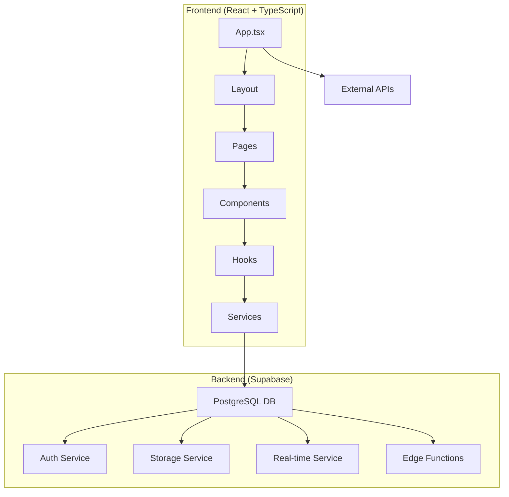
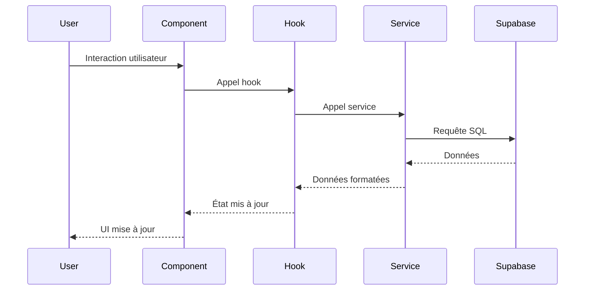

# 🏗️ Architecture Technique - Shopping Connect

## Vue d'Ensemble

Shopping Connect suit une architecture **moderne full-stack** avec séparation claire entre frontend et backend, utilisant Supabase comme Backend-as-a-Service pour simplifier le développement et la maintenance.

## 🎯 Architecture Générale



## 🖥️ Frontend Architecture

### Structure Modulaire

```
Frontend/
├── 🎨 Presentation Layer
│   ├── Components/ (UI réutilisables)
│   ├── Pages/ (Vues complètes)
│   └── Layout/ (Structure générale)
├── 🧠 Business Logic Layer
│   ├── Hooks/ (Logique métier)
│   ├── Services/ (API calls)
│   └── Utils/ (Fonctions utilitaires)
├── 📊 State Management
│   ├── Context API (Auth, Cart)
│   ├── Local State (useState)
│   └── Server State (Supabase)
└── 🎭 UI/UX Layer
    ├── Tailwind CSS (Styling)
    ├── Framer Motion (Animations)
    └── Design System (Tokens)
```

### Patterns Architecturaux

#### 1. **Component Composition**
```typescript
// Composant conteneur avec logique
export function VideoFeed({ products }: VideoFeedProps) {
  const [currentIndex, setCurrentIndex] = useState(0);
  const { addToCart } = useCart();
  
  return (
    <div className="video-feed">
      {products.map(product => (
        <VideoCard 
          key={product.id} 
          product={product}
          onAddToCart={addToCart}
        />
      ))}
    </div>
  );
}
```

#### 2. **Custom Hooks Pattern**
```typescript
// Logique métier réutilisable
export function useAuth() {
  const [user, setUser] = useState<User | null>(null);
  const [loading, setLoading] = useState(true);
  
  const signIn = async (email: string, password: string) => {
    // Logique d'authentification
  };
  
  return { user, loading, signIn, signOut };
}
```

#### 3. **Service Layer Pattern**
```typescript
// Abstraction des appels API
export class ProductService {
  static async getProducts(): Promise<Product[]> {
    const { data, error } = await supabase
      .from('products')
      .select('*, seller:users(*)')
      .eq('status', 'active');
    
    if (error) throw error;
    return data;
  }
}
```

### State Management Strategy

#### **Context API** pour l'état global
- `AuthProvider` : Authentification utilisateur
- `CartProvider` : Gestion du panier
- `ThemeProvider` : Thème et préférences

#### **Local State** pour l'état composant
- `useState` pour l'état local
- `useReducer` pour l'état complexe
- `useRef` pour les références DOM

#### **Server State** via Supabase
- Real-time subscriptions
- Optimistic updates
- Cache automatique

## 🗄️ Backend Architecture (Supabase)

### Base de Données PostgreSQL

#### **Schéma Relationnel**
```sql
-- Tables principales
users (id, email, username, avatar_url, ...)
products (id, seller_id, name, price, images, ...)
orders (id, user_id, status, total, ...)
cart_items (id, cart_id, product_id, quantity, ...)

-- Relations
users 1:N products (seller_id)
users 1:N orders (user_id)
products 1:N cart_items (product_id)
```

#### **Politiques de Sécurité (RLS)**
```sql
-- Exemple : Accès aux produits
CREATE POLICY "Anyone can view active products" 
ON products FOR SELECT 
USING (status = 'active');

-- Exemple : Gestion des produits par le vendeur
CREATE POLICY "Sellers can manage their own products" 
ON products FOR ALL 
USING (auth.uid() = seller_id);
```

### Services Supabase

#### **1. Authentication Service**
- **PKCE Flow** pour la sécurité
- **Session persistence** avec localStorage
- **Auto-refresh** des tokens
- **Social login** (Google, GitHub)

#### **2. Storage Service**
- **Buckets organisés** : `products`, `profiles`
- **Upload sécurisé** avec RLS
- **CDN intégré** pour les performances
- **Optimisation automatique** des images

#### **3. Real-time Service**
- **Subscriptions** en temps réel
- **Presence** pour les utilisateurs connectés
- **Broadcast** pour les notifications
- **WebSocket** optimisé

#### **4. Edge Functions** (Futur)
- **Serverless functions** à la périphérie
- **Processing** des paiements
- **Notifications** push
- **Analytics** en temps réel

## 🔄 Data Flow Architecture

### Flux de Données Principal



### Patterns de Communication

#### **1. Unidirectional Data Flow**
```
User Action → Component → Hook → Service → Database
                ↓
UI Update ← State Update ← Data Processing ← Response
```

#### **2. Event-Driven Architecture**
```typescript
// Écoute des changements en temps réel
useEffect(() => {
  const subscription = supabase
    .channel('products')
    .on('postgres_changes', {
      event: 'INSERT',
      schema: 'public',
      table: 'products'
    }, (payload) => {
      // Mise à jour automatique de l'UI
      setProducts(prev => [...prev, payload.new]);
    })
    .subscribe();
    
  return () => subscription.unsubscribe();
}, []);
```

## 🎨 UI/UX Architecture

### Design System

#### **Token System**
```typescript
// Couleurs
const colors = {
  primary: {
    50: '#faf5ff',
    500: '#a855f7',
    900: '#581c87'
  },
  surface: {
    50: '#f8fafc',
    900: '#0f172a'
  }
};

// Espacements
const spacing = {
  xs: '0.5rem',
  sm: '1rem',
  md: '1.5rem',
  lg: '2rem'
};
```

#### **Component Hierarchy**
```
App
├── Layout
│   ├── TopBar
│   ├── Main Content
│   └── BottomNav
├── Pages
│   ├── Home (VideoFeed)
│   ├── Profile
│   └── ProductDetail
└── Components
    ├── UserAvatar
    ├── ProductCard
    └── MediaUploader
```

### Animation Architecture

#### **Framer Motion Integration**
```typescript
// Animations déclaratives
<motion.div
  initial={{ opacity: 0, y: 20 }}
  animate={{ opacity: 1, y: 0 }}
  exit={{ opacity: 0, y: -20 }}
  transition={{ duration: 0.3 }}
>
  {content}
</motion.div>
```

#### **Performance Optimizations**
- **Lazy loading** des composants
- **Memoization** avec React.memo
- **Virtual scrolling** pour les listes longues
- **Image optimization** avec Supabase

## 🔒 Sécurité Architecture

### Frontend Security

#### **1. Input Validation**
```typescript
// Validation côté client
const validateProduct = (data: ProductFormData) => {
  if (!data.name.trim()) throw new Error('Nom requis');
  if (data.price <= 0) throw new Error('Prix invalide');
  return true;
};
```

#### **2. XSS Protection**
- **Sanitization** des inputs utilisateur
- **CSP headers** via Supabase
- **Escape** automatique avec React

#### **3. Authentication Flow**
```typescript
// PKCE flow sécurisé
const signIn = async (email: string, password: string) => {
  const { data, error } = await supabase.auth.signInWithPassword({
    email,
    password
  });
  
  if (error) throw new Error(error.message);
  return data;
};
```

### Backend Security (Supabase)

#### **1. Row Level Security (RLS)**
```sql
-- Politique restrictive
CREATE POLICY "Users can only access their own data" 
ON users FOR ALL 
USING (auth.uid() = id);
```

#### **2. API Security**
- **Rate limiting** automatique
- **CORS** configuré
- **JWT tokens** sécurisés
- **HTTPS** obligatoire

#### **3. Data Validation**
```sql
-- Contraintes de base de données
ALTER TABLE products 
ADD CONSTRAINT check_price_positive 
CHECK (price > 0);
```

## 📊 Performance Architecture

### Frontend Optimizations

#### **1. Bundle Optimization**
- **Code splitting** par route
- **Tree shaking** automatique
- **Dynamic imports** pour les composants lourds
- **Vite** pour le build ultra-rapide

#### **2. Runtime Performance**
```typescript
// Memoization des calculs coûteux
const expensiveValue = useMemo(() => {
  return heavyCalculation(data);
}, [data]);

// Callback optimization
const handleClick = useCallback(() => {
  onAction(id);
}, [id, onAction]);
```

#### **3. Network Optimization**
- **Request deduplication**
- **Optimistic updates**
- **Background sync**
- **Offline support** (futur)

### Backend Performance (Supabase)

#### **1. Database Optimization**
```sql
-- Indexes pour les requêtes fréquentes
CREATE INDEX idx_products_status_created 
ON products(status, created_at DESC);

-- Index composite pour les jointures
CREATE INDEX idx_products_seller_status 
ON products(seller_id, status);
```

#### **2. Caching Strategy**
- **CDN** intégré pour les assets
- **Edge caching** pour les API
- **Database query caching**
- **Real-time cache** pour les subscriptions

## 🚀 Scalability Architecture

### Horizontal Scaling

#### **Frontend Scaling**
- **CDN distribution** (Vercel, Netlify)
- **Edge functions** pour la logique serveur
- **Micro-frontends** (futur)
- **Progressive Web App** (PWA)

#### **Backend Scaling (Supabase)**
- **Auto-scaling** PostgreSQL
- **Read replicas** pour les requêtes
- **Connection pooling** automatique
- **Global edge** deployment

### Vertical Scaling

#### **Performance Monitoring**
```typescript
// Métriques de performance
const trackPerformance = (action: string, duration: number) => {
  analytics.track('performance', {
    action,
    duration,
    timestamp: Date.now()
  });
};
```

#### **Error Handling**
```typescript
// Error boundary global
export function ErrorBoundary({ children }: { children: React.ReactNode }) {
  return (
    <ErrorBoundaryComponent
      onError={(error, errorInfo) => {
        console.error('App Error:', error, errorInfo);
        // Envoi vers service de monitoring
      }}
    >
      {children}
    </ErrorBoundaryComponent>
  );
}
```

## 🔮 Architecture Future

### Roadmap Technique

#### **Phase 1 : MVP** ✅
- Architecture de base
- Authentification
- CRUD produits
- Feed vidéo

#### **Phase 2 : V1** 🚧
- Live streaming
- Paiements intégrés
- Notifications push
- Analytics avancées

#### **Phase 3 : V2** 📋
- IA pour recommandations
- Multi-tenant architecture
- Mobile apps natives
- Marketplace avancé

### Évolutions Architecturales

#### **Microservices Migration**
```
Monolith (Supabase) → Microservices
├── Auth Service
├── Product Service  
├── Payment Service
├── Notification Service
└── Analytics Service
```

#### **Event-Driven Architecture**
```typescript
// Event sourcing pour l'audit
interface ProductEvent {
  type: 'PRODUCT_CREATED' | 'PRODUCT_UPDATED';
  payload: ProductData;
  timestamp: Date;
  userId: string;
}
```

---

Cette architecture garantit **scalabilité**, **maintenabilité** et **performance** pour Shopping Connect, tout en restant **simple** et **évolutive** pour l'équipe de développement.
