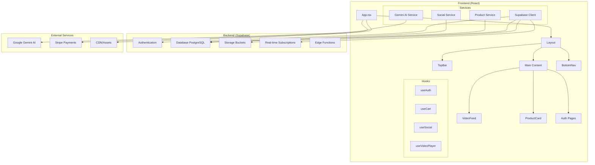
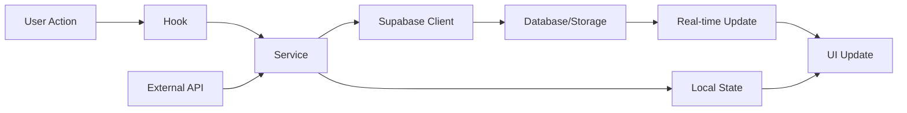
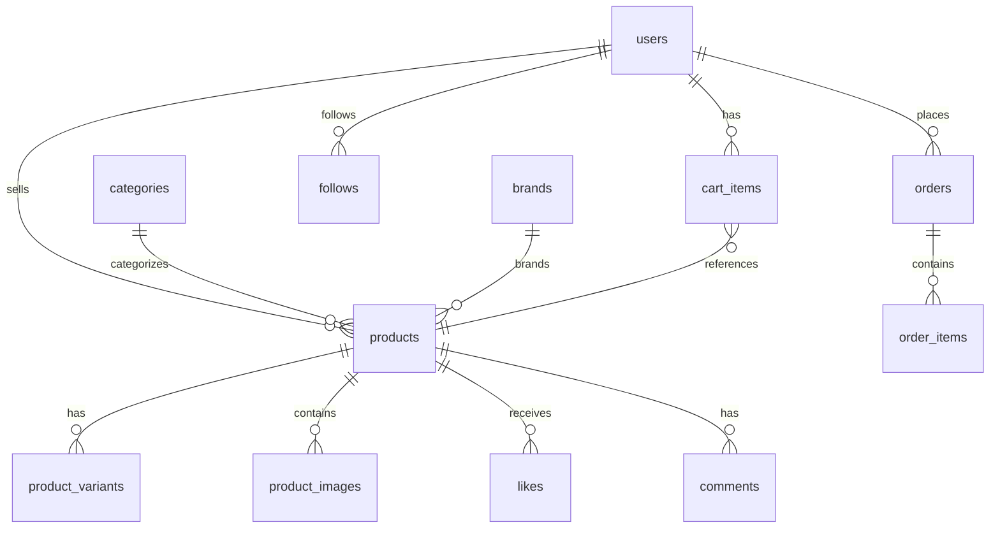
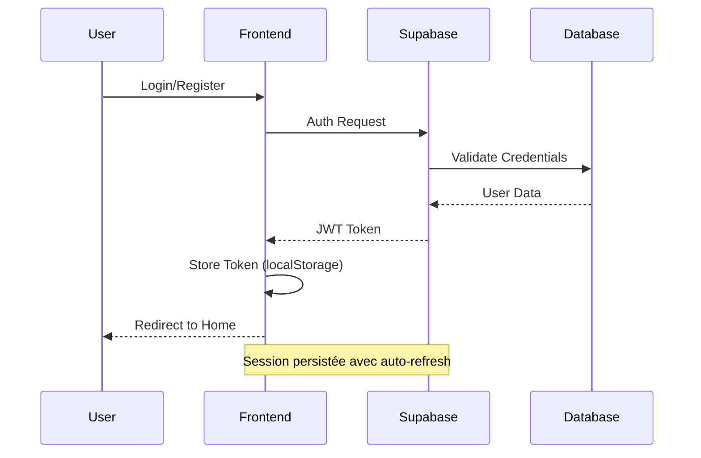
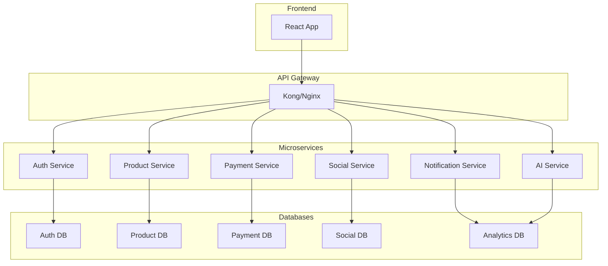

# 🏗️ Architecture - SocialCart

## Vue d'ensemble

SocialCart utilise une architecture moderne **JAMstack** (JavaScript, APIs, Markup) avec React côté client et Supabase comme Backend-as-a-Service, optimisée pour les performances, la scalabilité et l'expérience utilisateur mobile-first.

## 🎯 Principes Architecturaux

### 1. **Mobile-First Design**
- Interface adaptée aux gestes tactiles (swipe, tap, pinch)
- Optimisation pour les écrans verticaux (portrait)
- Performance prioritaire sur mobile (3G/4G)
- PWA avec installation native

### 2. **Composants Réutilisables**
- Architecture modulaire avec composants isolés
- Hooks personnalisés pour la logique métier
- Design System cohérent avec Tailwind CSS
- Séparation claire des responsabilités

### 3. **Performance et UX**
- Lazy loading des composants et routes
- Optimisation des images et vidéos
- Animations fluides avec Framer Motion
- Cache intelligent avec Service Worker

### 4. **Sécurité et Scalabilité**
- Row Level Security (RLS) sur toutes les tables
- Authentification sécurisée avec Supabase Auth
- Architecture évolutive vers microservices
- Monitoring et analytics intégrés

## 🏛️ Architecture Globale



## 📱 Architecture Frontend

### Structure des Composants

```
src/
├── components/           # Composants UI réutilisables
│   ├── Layout/          # Structure principale
│   ├── VideoFeed/       # Feed vidéo social modulaire
│   │   ├── VideoPlayer.tsx
│   │   ├── ActionButtons.tsx
│   │   ├── ProductInfo.tsx
│   │   └── ...
│   ├── ProductCard/     # Cartes produits
│   ├── Navigation/      # TopBar, BottomNav
│   └── Modals/          # Commentaires, Partage, etc.
├── hooks/               # Logique métier réutilisable
│   ├── useAuth.tsx      # Authentification
│   ├── useCart.tsx      # Gestion panier
│   ├── useSocial.tsx    # Interactions sociales
│   ├── useVideoPlayer.tsx # Gestion vidéo
│   └── useVideoFeedScroll.tsx # Scroll optimisé
├── lib/                 # Services et clients
│   ├── supabase.ts      # Client Supabase
│   ├── products.ts      # Service produits
│   ├── social.ts        # Service social
│   └── gemini.ts        # Service IA
└── pages/               # Pages de l'application
    ├── Home.tsx         # Feed principal
    ├── Cart.tsx         # Panier
    └── Profile.tsx      # Profil utilisateur
```

### Flux de Données



### Gestion d'État

#### État Global (Context)
```typescript
// AuthContext
interface AuthState {
  user: User | null;
  loading: boolean;
  signIn: (email: string, password: string) => Promise<void>;
  signOut: () => Promise<void>;
  updateProfile: (data: ProfileUpdateData) => Promise<void>;
}

// CartContext
interface CartState {
  items: CartItem[];
  addItem: (product: Product, variants?: Record<string, string>) => void;
  removeItem: (itemId: string) => void;
  clearCart: () => void;
  total: number;
  itemCount: number;
}
```

#### État Local (useState/useReducer)
- **États UI** : modales, loading, erreurs
- **États temporaires** : formulaires, filtres
- **États de cache** : données mises en cache localement

## 🗄️ Architecture Backend (Supabase)

### Base de Données PostgreSQL

#### Tables Principales

```sql
-- Utilisateurs et profils
users                 # Profils utilisateurs complets
user_addresses        # Adresses de livraison
user_social_profiles  # Profils sociaux (Instagram, TikTok)

-- Produits et catalogue
products             # Catalogue produits avec métadonnées
product_variants     # Variantes de produits (taille, couleur)
product_images       # Images multiples par produit
categories           # Catégories hiérarchiques
brands              # Marques

-- E-commerce
cart_items          # Panier utilisateur
orders              # Commandes avec statuts
order_items         # Articles commandés (snapshot)
payments           # Paiements avec intégration Stripe

-- Social et interactions
follows            # Relations de suivi
likes             # Likes sur produits
comments          # Commentaires avec réponses
shares            # Partages sur réseaux sociaux
product_views     # Analytics des vues

-- Système de fidélité
loyalty_transactions # Transactions de points
loyalty_actions     # Actions récompensées
```

#### Relations Clés



### Row Level Security (RLS)

#### Politiques de Sécurité

```sql
-- Politique pour les produits (lecture publique)
CREATE POLICY "Products are viewable by everyone" ON products
    FOR SELECT USING (true);

-- Politique pour les paniers (propriétaire uniquement)
CREATE POLICY "Users can view own cart" ON cart_items
    FOR SELECT USING (auth.uid() = user_id);

-- Politique pour les commandes (propriétaire uniquement)
CREATE POLICY "Users can view own orders" ON orders
    FOR SELECT USING (auth.uid() = user_id);

-- Politique pour les vendeurs (gestion de leurs produits)
CREATE POLICY "Sellers can manage their products" ON products
    FOR ALL USING (auth.uid() = seller_id);
```

### Storage Buckets

```
storage/
├── products/           # Images et vidéos produits (public)
├── user-avatars/       # Avatars utilisateurs (public)
└── temp-uploads/       # Uploads temporaires (private)
```

## 🔄 Flux d'Authentification



## 🎥 Architecture VideoFeed

### Composant Principal Modulaire

```typescript
interface VideoFeedProps {
  products: VideoFeedProduct[];
}

// Structure interne modulaire
const VideoFeed = ({ products }) => {
  // États locaux
  const [currentIndex, setCurrentIndex] = useState(0);
  const [isPlaying, setIsPlaying] = useState(false);
  
  // Hooks personnalisés
  const { addItem } = useCart();
  const { likeProduct, followUser } = useSocial();
  const { 
    videoRefs, 
    autoPlay, 
    togglePlay, 
    handleVideoLoad 
  } = useVideoPlayer();
  
  // Gestion des gestes
  const { handleSwipeUp, handleSwipeDown } = useVideoFeedScroll();
  
  return (
    <div className="video-container">
      <VideoPlayer 
        product={currentProduct}
        videoRefs={videoRefs}
        autoPlay={autoPlay}
        onTogglePlay={togglePlay}
      />
      <ActionButtons 
        product={currentProduct}
        onLike={likeProduct}
        onFollow={followUser}
        onShare={shareProduct}
      />
      <ProductInfo 
        product={currentProduct}
        onAddToCart={addItem}
      />
    </div>
  );
};
```

### Optimisations Vidéo

1. **Lazy Loading** : Chargement à la demande
2. **Preloading** : Préchargement de la vidéo suivante
3. **Adaptive Streaming** : Qualité adaptée à la connexion
4. **Memory Management** : Nettoyage des vidéos non visibles
5. **Throttling** : Scroll optimisé avec cleanup automatique

## 🔧 Services et API

### Service Produits

```typescript
class ProductService {
  static async getProducts(filters?: ProductFilters): Promise<Product[]> {
    const { data, error } = await supabase
      .from('products')
      .select(`
        *,
        seller:users(*),
        images:product_images(*),
        variants:product_variants(*)
      `)
      .eq('status', 'active');
    
    if (error) throw error;
    return data;
  }
  
  static async createProduct(productData: CreateProductData): Promise<Product> {
    // Upload des médias
    const { images, videoUrl } = await this.uploadMedia(
      productData.files, 
      productData.videoFile
    );
    
    // Création du produit
    const { data, error } = await supabase
      .from('products')
      .insert({
        ...productData,
        images,
        video_url: videoUrl
      })
      .select()
      .single();
    
    if (error) throw error;
    return data;
  }
}
```

### Service Social

```typescript
class SocialService {
  static async toggleProductLike(productId: string): Promise<boolean> {
    const { data: existingLike } = await supabase
      .from('likes')
      .select('id')
      .eq('product_id', productId)
      .eq('user_id', user.id)
      .single();

    if (existingLike) {
      // Retirer le like
      await supabase
        .from('likes')
        .delete()
        .eq('product_id', productId)
        .eq('user_id', user.id);
      return false;
    } else {
      // Ajouter le like
      await supabase
        .from('likes')
        .insert({ product_id: productId, user_id: user.id });
      return true;
    }
  }
}
```

### Service IA (Gemini)

```typescript
class GeminiService {
  static async analyzeProductImage(imageFile: File): Promise<ProductAnalysisResult> {
    const imageData = await this.fileToBase64(imageFile);
    
    const result = await this.model.generateContent([
      this.buildAnalysisPrompt(),
      {
        inlineData: {
          data: imageData,
          mimeType: imageFile.type,
        },
      }
    ]);
    
    return this.parseAnalysisResponse(result.response.text());
  }
}
```

## 🚀 Optimisations Performance

### 1. **Code Splitting**

```typescript
// Lazy loading des pages
const Home = lazy(() => import('./pages/Home'));
const Cart = lazy(() => import('./pages/Cart'));
const Profile = lazy(() => import('./pages/Profile'));

// Lazy loading des composants lourds
const ImageAnalysisPanel = lazy(() => import('./components/ImageAnalysisPanel'));
```

### 2. **Image Optimization**

```typescript
// Composant OptimizedImage
const OptimizedImage = ({ src, alt, ...props }) => {
  return (
    
  );
};
```

### 3. **Caching Strategy**

```typescript
// Cache des produits avec React Query (futur)
const { data: products } = useQuery({
  queryKey: ['products'],
  queryFn: ProductService.getProducts,
  staleTime: 5 * 60 * 1000, // 5 minutes
  cacheTime: 10 * 60 * 1000, // 10 minutes
});
```

### 4. **Service Worker Optimisé**

```javascript
// sw.js - Stratégies de cache
const CACHE_STRATEGIES = {
  images: 'cache-first',
  videos: 'network-first',
  api: 'network-first',
  static: 'cache-first'
};

// Gestion d'erreur robuste
async function networkFirst(request, cacheName) {
  try {
    const networkResponse = await fetch(request);
    // Mise en cache
    return networkResponse;
  } catch (error) {
    // Fallback vers le cache
    const cachedResponse = await caches.match(request);
    return cachedResponse || new Response('Offline', { status: 503 });
  }
}
```

## 🔒 Sécurité

### Frontend

1. **Validation des entrées** côté client
2. **Sanitisation** des données utilisateur
3. **HTTPS** obligatoire en production
4. **CSP** (Content Security Policy)
5. **XSS Protection** avec React

### Backend (Supabase)

1. **RLS** activé sur toutes les tables
2. **Policies** granulaires par utilisateur
3. **Validation** des schémas avec contraintes
4. **Rate limiting** sur les API
5. **Audit logs** pour les actions sensibles

## 📱 PWA Architecture

### Service Worker

```javascript
// sw.js - Stratégies de cache
const CACHE_STRATEGIES = {
  images: 'cache-first',
  videos: 'network-first',
  api: 'network-first',
  static: 'cache-first'
};

// Gestion des mises à jour
self.addEventListener('message', (event) => {
  if (event.data && event.data.type === 'SKIP_WAITING') {
    self.skipWaiting();
  }
});
```

### Manifest

```json
{
  "name": "SocialCart - Shopping Social",
  "short_name": "SocialCart",
  "display": "standalone",
  "orientation": "portrait-primary",
  "theme_color": "#0ea5e9",
  "background_color": "#ffffff",
  "start_url": "/",
  "scope": "/"
}
```

## 🔄 Real-time Features

### Supabase Realtime

```typescript
// Écoute des changements en temps réel
useEffect(() => {
  const subscription = supabase
    .channel('products')
    .on('postgres_changes', 
      { event: 'UPDATE', schema: 'public', table: 'products' },
      (payload) => {
        // Mettre à jour l'UI
        updateProductInFeed(payload.new);
      }
    )
    .subscribe();
    
  return () => subscription.unsubscribe();
}, []);
```

### WebSocket pour le Chat (futur)

```typescript
// Chat en temps réel avec les vendeurs
const useChat = (productId: string) => {
  const [messages, setMessages] = useState<Message[]>([]);
  
  useEffect(() => {
    const ws = new WebSocket(`wss://api.socialcart.app/chat/${productId}`);
    
    ws.onmessage = (event) => {
      const message = JSON.parse(event.data);
      setMessages(prev => [...prev, message]);
    };
    
    return () => ws.close();
  }, [productId]);
  
  return { messages, sendMessage };
};
```

## 🚀 Déploiement et Scaling

### Environnements

- **Development** : localhost avec Supabase local
- **Staging** : Vercel Preview avec Supabase staging
- **Production** : Vercel Production avec Supabase production

### Monitoring

1. **Core Web Vitals** avec Vercel Analytics
2. **Error Tracking** avec Sentry (futur)
3. **Performance** avec Lighthouse CI
4. **Database** monitoring avec Supabase Dashboard
5. **Real-time** métriques avec Supabase Metrics

### Scaling Strategy

#### Phase 1 : Monolithique Optimisé
- **Supabase** comme backend principal
- **React** frontend avec optimisations
- **CDN** pour les assets statiques
- **Monitoring** basique

#### Phase 2 : Microservices Hybrides
- **API Gateway** pour router les requêtes
- **Services spécialisés** (auth, payments, social)
- **Base de données** distribuée
- **Cache** Redis distribué

#### Phase 3 : Cloud Native
- **Kubernetes** pour l'orchestration
- **Microservices** complets
- **Event-driven** architecture
- **Multi-cloud** deployment

## 🔮 Évolutions Futures

### Architecture Microservices (Phase 2)



### Optimisations Futures

1. **Server-Side Rendering** avec Next.js
2. **GraphQL** pour des requêtes optimisées
3. **CDN** global pour les performances
4. **Edge Computing** pour la latence minimale
5. **Machine Learning** pour les recommandations
6. **Blockchain** pour la traçabilité des produits

---

Cette architecture est conçue pour évoluer avec les besoins de l'application tout en maintenant la simplicité, les performances optimales et une expérience utilisateur exceptionnelle.