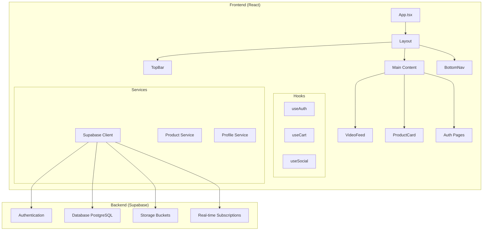
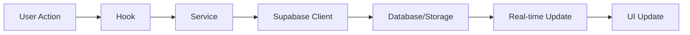
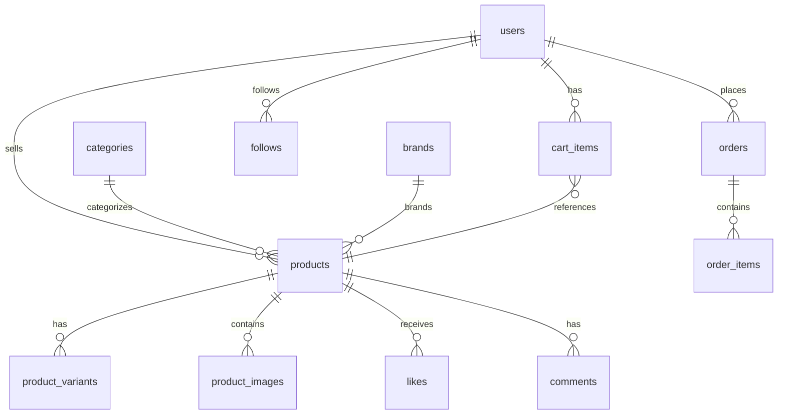
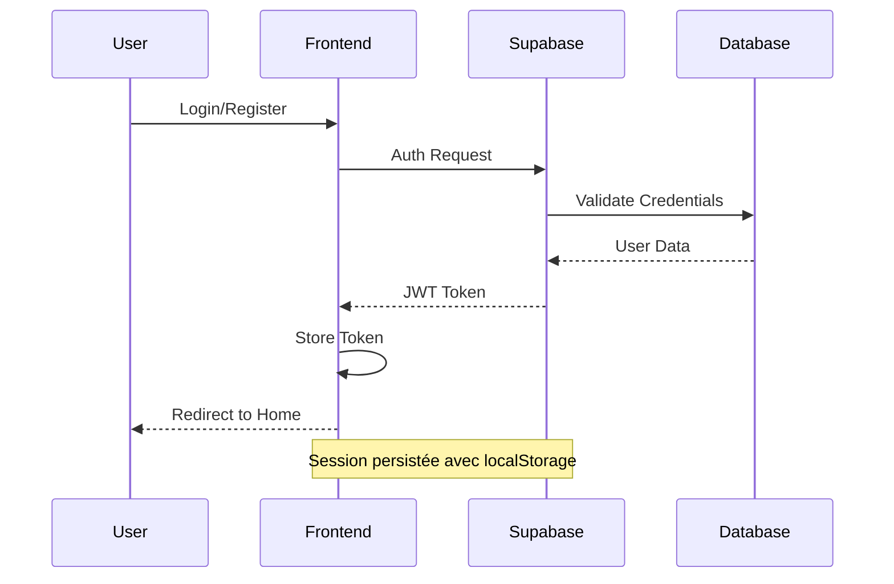
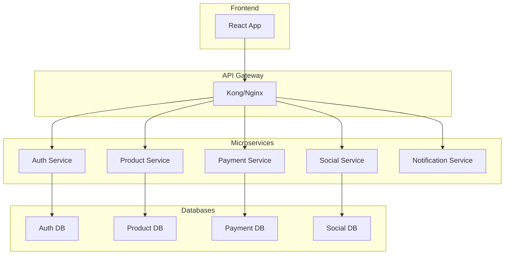

# 🏗️ Architecture - SocialCart

## Vue d'ensemble

SocialCart utilise une architecture moderne **JAMstack** (JavaScript, APIs, Markup) avec React côté client et Supabase comme Backend-as-a-Service, optimisée pour les performances et la scalabilité.

## 🎯 Principes Architecturaux

### 1. **Mobile-First Design**
- Interface adaptée aux gestes tactiles
- Optimisation pour les écrans verticaux
- Performance prioritaire sur mobile

### 2. **Composants Réutilisables**
- Architecture modulaire avec composants isolés
- Hooks personnalisés pour la logique métier
- Design System cohérent

### 3. **Performance et UX**
- Lazy loading des composants
- Optimisation des images et vidéos
- Animations fluides avec Framer Motion

## 🏛️ Architecture Globale



## 📱 Architecture Frontend

### Structure des Composants

```
src/
├── components/           # Composants UI réutilisables
│   ├── Layout/          # Structure principale
│   ├── VideoFeed/       # Feed vidéo social
│   ├── ProductCard/     # Cartes produits
│   ├── Navigation/      # TopBar, BottomNav
│   └── Modals/          # Commentaires, Partage
├── hooks/               # Logique métier
│   ├── useAuth.tsx      # Authentification
│   ├── useCart.tsx      # Gestion panier
│   └── useSocial.tsx    # Interactions sociales
├── lib/                 # Services et clients
│   ├── supabase.ts      # Client Supabase
│   ├── products.ts      # Service produits
│   └── social.ts        # Service social
└── pages/               # Pages de l'application
    ├── Home.tsx         # Feed principal
    ├── Cart.tsx         # Panier
    └── Profile.tsx      # Profil utilisateur
```

### Flux de Données



## 🗄️ Architecture Backend (Supabase)

### Base de Données PostgreSQL

#### Tables Principales

```sql
-- Utilisateurs et profils
users                 # Profils utilisateurs
user_addresses        # Adresses de livraison
user_social_profiles  # Profils sociaux

-- Produits et catalogue
products             # Catalogue produits
product_variants     # Variantes de produits
product_images       # Images produits
categories           # Catégories produits
brands              # Marques

-- E-commerce
cart_items          # Panier utilisateur
orders              # Commandes
order_items         # Articles commandés
payments           # Paiements

-- Social et interactions
follows            # Relations de suivi
likes             # Likes sur produits
comments          # Commentaires
shares            # Partages
```

#### Relations Clés



### Row Level Security (RLS)

#### Politiques de Sécurité

```sql
-- Politique pour les produits (lecture publique)
CREATE POLICY "Products are viewable by everyone" ON products
    FOR SELECT USING (true);

-- Politique pour les paniers (propriétaire uniquement)
CREATE POLICY "Users can view own cart" ON cart_items
    FOR SELECT USING (auth.uid() = user_id);

-- Politique pour les commandes (propriétaire uniquement)
CREATE POLICY "Users can view own orders" ON orders
    FOR SELECT USING (auth.uid() = user_id);
```

### Storage Buckets

```
storage/
├── product-images/     # Images produits (public)
├── product-videos/     # Vidéos produits (public)
├── user-avatars/       # Avatars utilisateurs (public)
└── temp-uploads/       # Uploads temporaires (private)
```

## 🔄 Flux d'Authentification



## 📊 Gestion d'État

### État Global (Context)

```typescript
// AuthContext
interface AuthState {
  user: User | null;
  loading: boolean;
  signIn: (email: string, password: string) => Promise<void>;
  signOut: () => Promise<void>;
}

// CartContext
interface CartState {
  items: CartItem[];
  addItem: (product: Product, quantity: number) => void;
  removeItem: (productId: string) => void;
  clearCart: () => void;
}
```

### État Local (useState/useReducer)

- **États UI** : modales, loading, erreurs
- **États temporaires** : formulaires, filtres
- **États de cache** : données mises en cache localement

## 🎥 Architecture VideoFeed

### Composant Principal

```typescript
interface VideoFeedProps {
  products: VideoFeedProduct[];
}

// Structure interne
const VideoFeed = ({ products }) => {
  // États locaux
  const [currentIndex, setCurrentIndex] = useState(0);
  const [isPlaying, setIsPlaying] = useState(false);
  const [showInfo, setShowInfo] = useState(false);
  
  // Hooks personnalisés
  const { addItem } = useCart();
  const { likeProduct, followUser } = useSocial();
  
  // Gestion des gestes
  const { handleSwipeUp, handleSwipeDown } = useGestures();
  
  return (
    <div className="video-container">
      {/* Video Player */}
      {/* Overlay Interactions */}
      {/* Product Info */}
    </div>
  );
};
```

### Optimisations Vidéo

1. **Lazy Loading** : Chargement à la demande
2. **Preloading** : Préchargement de la vidéo suivante
3. **Adaptive Streaming** : Qualité adaptée à la connexion
4. **Memory Management** : Nettoyage des vidéos non visibles

## 🔧 Services et API

### Service Produits

```typescript
class ProductService {
  static async getProducts(filters?: ProductFilters): Promise<Product[]> {
    const { data, error } = await supabase
      .from('products')
      .select(`
        *,
        user:users(*),
        images:product_images(*),
        variants:product_variants(*)
      `)
      .eq('status', 'active');
    
    if (error) throw error;
    return data;
  }
  
  static async getProductById(id: string): Promise<Product> {
    // Implementation
  }
  
  static async createProduct(productData: CreateProductData): Promise<Product> {
    // Implementation
  }
}
```

### Service Social

```typescript
class SocialService {
  static async likeProduct(productId: string): Promise<void> {
    const { error } = await supabase
      .from('likes')
      .insert({ product_id: productId, user_id: user.id });
    
    if (error) throw error;
  }
  
  static async followUser(userId: string): Promise<void> {
    // Implementation
  }
  
  static async addComment(productId: string, content: string): Promise<Comment> {
    // Implementation
  }
}
```

## 🚀 Optimisations Performance

### 1. **Code Splitting**

```typescript
// Lazy loading des pages
const Home = lazy(() => import('./pages/Home'));
const Cart = lazy(() => import('./pages/Cart'));
const Profile = lazy(() => import('./pages/Profile'));
```

### 2. **Image Optimization**

```typescript
// Composant OptimizedImage
const OptimizedImage = ({ src, alt, ...props }) => {
  return (
    
  );
};
```

### 3. **Caching Strategy**

```typescript
// Cache des produits avec React Query (futur)
const { data: products } = useQuery({
  queryKey: ['products'],
  queryFn: ProductService.getProducts,
  staleTime: 5 * 60 * 1000, // 5 minutes
  cacheTime: 10 * 60 * 1000, // 10 minutes
});
```

## 🔒 Sécurité

### Frontend

1. **Validation des entrées** côté client
2. **Sanitisation** des données utilisateur
3. **HTTPS** obligatoire en production
4. **CSP** (Content Security Policy)

### Backend (Supabase)

1. **RLS** activé sur toutes les tables
2. **Policies** granulaires par utilisateur
3. **Validation** des schémas avec Zod (futur)
4. **Rate limiting** sur les API

## 📱 PWA Architecture

### Service Worker

```javascript
// sw.js - Stratégies de cache
const CACHE_STRATEGIES = {
  images: 'cache-first',
  videos: 'network-first',
  api: 'network-first',
  static: 'cache-first'
};
```

### Manifest

```json
{
  "name": "SocialCart - Shopping Social",
  "short_name": "SocialCart",
  "display": "standalone",
  "orientation": "portrait-primary",
  "theme_color": "#0ea5e9"
}
```

## 🔄 Real-time Features

### Supabase Realtime

```typescript
// Écoute des changements en temps réel
useEffect(() => {
  const subscription = supabase
    .channel('products')
    .on('postgres_changes', 
      { event: 'UPDATE', schema: 'public', table: 'products' },
      (payload) => {
        // Mettre à jour l'UI
        updateProductInFeed(payload.new);
      }
    )
    .subscribe();

  return () => subscription.unsubscribe();
}, []);
```

## 🚀 Déploiement et Scaling

### Environnements

- **Development** : localhost avec Supabase local
- **Staging** : Vercel Preview avec Supabase staging
- **Production** : Vercel Production avec Supabase production

### Monitoring

1. **Core Web Vitals** avec Vercel Analytics
2. **Error Tracking** avec Sentry (futur)
3. **Performance** avec Lighthouse CI
4. **Database** monitoring avec Supabase Dashboard

## 🔮 Évolutions Futures

### Architecture Microservices (Phase 2)



### Optimisations Futures

1. **Server-Side Rendering** avec Next.js
2. **GraphQL** pour des requêtes optimisées
3. **CDN** pour les assets statiques
4. **Edge Computing** pour les performances globales
5. **Machine Learning** pour les recommandations

---

Cette architecture est conçue pour évoluer avec les besoins de l'application tout en maintenant la simplicité et les performances optimales.