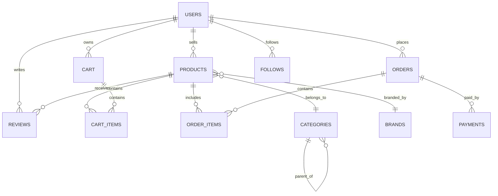

# 🗄️ Base de Données - Shopping Connect

## Vue d'Ensemble

Shopping Connect utilise **PostgreSQL** via Supabase avec un schéma relationnel optimisé pour l'e-commerce social. La base de données est conçue pour supporter les fonctionnalités de shopping vidéo, gestion de produits, commandes et interactions sociales.

## 📊 Schéma de Base de Données

### Diagramme Relationnel



## 🏗️ Tables Principales

### 1. Table `users` - Utilisateurs

**Description :** Stocke les informations des utilisateurs (acheteurs et vendeurs).

```sql
CREATE TABLE users (
    id UUID PRIMARY KEY DEFAULT gen_random_uuid(),
    email VARCHAR(255) UNIQUE NOT NULL,
    username VARCHAR(50) UNIQUE NOT NULL,
    full_name VARCHAR(100),
    avatar_url TEXT,
    phone VARCHAR(20),
    date_of_birth DATE,
    gender VARCHAR(10) CHECK (gender IN ('male', 'female', 'other')),
    loyalty_points INTEGER DEFAULT 0,
    is_seller BOOLEAN DEFAULT FALSE,
    is_verified BOOLEAN DEFAULT FALSE,
    bio TEXT,
    location VARCHAR(100),
    website_url TEXT,
    instagram_handle VARCHAR(50),
    tiktok_handle VARCHAR(50),
    created_at TIMESTAMP WITH TIME ZONE DEFAULT NOW(),
    updated_at TIMESTAMP WITH TIME ZONE DEFAULT NOW()
);
```

**Champs Clés :**
- `id` : Identifiant unique UUID
- `email` : Email unique pour l'authentification
- `username` : Nom d'utilisateur unique pour l'affichage
- `avatar_url` : URL de l'image de profil
- `is_seller` : Indique si l'utilisateur peut vendre
- `loyalty_points` : Points de fidélité accumulés

**Index :**
```sql
CREATE INDEX idx_users_email ON users(email);
CREATE INDEX idx_users_username ON users(username);
CREATE INDEX idx_users_is_seller ON users(is_seller);
```

### 2. Table `products` - Produits

**Description :** Stocke les informations des produits avec support vidéo et images.

```sql
CREATE TABLE products (
    id UUID PRIMARY KEY DEFAULT gen_random_uuid(),
    seller_id UUID REFERENCES users(id) ON DELETE CASCADE,
    category_id UUID REFERENCES categories(id),
    brand_id UUID REFERENCES brands(id),
    name VARCHAR(255) NOT NULL,
    slug VARCHAR(255) UNIQUE NOT NULL,
    description TEXT NOT NULL,
    short_description VARCHAR(500),
    sku VARCHAR(100) UNIQUE,
    price DECIMAL(10,2) NOT NULL,
    compare_price DECIMAL(10,2),
    cost_price DECIMAL(10,2),
    weight DECIMAL(8,2),
    dimensions JSONB, -- {length, width, height, unit}
    status VARCHAR(20) DEFAULT 'draft' CHECK (status IN ('draft', 'active', 'inactive', 'archived')),
    inventory_tracking BOOLEAN DEFAULT TRUE,
    inventory_quantity INTEGER DEFAULT 0,
    allow_backorder BOOLEAN DEFAULT FALSE,
    requires_shipping BOOLEAN DEFAULT TRUE,
    taxable BOOLEAN DEFAULT TRUE,
    tags TEXT[],
    meta_title VARCHAR(255),
    meta_description TEXT,
    video_url TEXT,
    primary_image_url TEXT,
    images JSONB DEFAULT '[]', -- Array of image URLs
    likes_count INTEGER DEFAULT 0,
    views_count INTEGER DEFAULT 0,
    sales_count INTEGER DEFAULT 0,
    rating_average DECIMAL(3,2) DEFAULT 0,
    rating_count INTEGER DEFAULT 0,
    created_at TIMESTAMP WITH TIME ZONE DEFAULT NOW(),
    updated_at TIMESTAMP WITH TIME ZONE DEFAULT NOW()
);
```

**Champs Clés :**
- `seller_id` : Référence vers l'utilisateur vendeur
- `video_url` : URL de la vidéo de présentation
- `images` : Array JSON des URLs d'images
- `status` : Statut du produit (draft, active, inactive, archived)
- `inventory_quantity` : Quantité en stock
- `likes_count`, `views_count`, `sales_count` : Métriques sociales

**Index :**
```sql
CREATE INDEX idx_products_seller_id ON products(seller_id);
CREATE INDEX idx_products_category_id ON products(category_id);
CREATE INDEX idx_products_status ON products(status);
CREATE INDEX idx_products_created_at ON products(created_at);
CREATE INDEX idx_products_price ON products(price);
```

### 3. Table `categories` - Catégories

**Description :** Hiérarchie des catégories de produits.

```sql
CREATE TABLE categories (
    id UUID PRIMARY KEY DEFAULT gen_random_uuid(),
    name VARCHAR(100) NOT NULL,
    slug VARCHAR(100) UNIQUE NOT NULL,
    description TEXT,
    image_url TEXT,
    parent_id UUID REFERENCES categories(id),
    sort_order INTEGER DEFAULT 0,
    is_active BOOLEAN DEFAULT TRUE,
    created_at TIMESTAMP WITH TIME ZONE DEFAULT NOW(),
    updated_at TIMESTAMP WITH TIME ZONE DEFAULT NOW()
);
```

**Données Initiales :**
```sql
INSERT INTO categories (name, slug, description) VALUES
('Mode & Beauté', 'mode-beaute', 'Vêtements, accessoires et produits de beauté'),
('Électronique', 'electronique', 'Smartphones, ordinateurs et gadgets'),
('Maison & Jardin', 'maison-jardin', 'Décoration, mobilier et jardinage'),
('Sport & Loisirs', 'sport-loisirs', 'Équipements sportifs et activités'),
('Alimentation', 'alimentation', 'Produits alimentaires et boissons'),
('Enfants & Bébés', 'enfants-bebes', 'Articles pour enfants et bébés'),
('Automobile', 'automobile', 'Pièces et accessoires auto'),
('Livres & Médias', 'livres-medias', 'Livres, films et musique');
```

### 4. Table `brands` - Marques

**Description :** Marques des produits.

```sql
CREATE TABLE brands (
    id UUID PRIMARY KEY DEFAULT gen_random_uuid(),
    name VARCHAR(100) NOT NULL,
    slug VARCHAR(100) UNIQUE NOT NULL,
    description TEXT,
    logo_url TEXT,
    website_url TEXT,
    is_active BOOLEAN DEFAULT TRUE,
    created_at TIMESTAMP WITH TIME ZONE DEFAULT NOW(),
    updated_at TIMESTAMP WITH TIME ZONE DEFAULT NOW()
);
```

## 🛒 Tables E-commerce

### 5. Table `cart` - Panier

**Description :** Panier d'achat utilisateur.

```sql
CREATE TABLE cart (
    id UUID PRIMARY KEY DEFAULT gen_random_uuid(),
    user_id UUID REFERENCES users(id) ON DELETE CASCADE,
    session_id VARCHAR(255), -- Pour utilisateurs non connectés
    created_at TIMESTAMP WITH TIME ZONE DEFAULT NOW(),
    updated_at TIMESTAMP WITH TIME ZONE DEFAULT NOW(),
    UNIQUE(user_id),
    UNIQUE(session_id)
);
```

### 6. Table `cart_items` - Articles du Panier

**Description :** Articles dans le panier avec variantes.

```sql
CREATE TABLE cart_items (
    id UUID PRIMARY KEY DEFAULT gen_random_uuid(),
    cart_id UUID REFERENCES cart(id) ON DELETE CASCADE,
    product_id UUID REFERENCES products(id) ON DELETE CASCADE,
    variant_values JSONB DEFAULT '{}', -- Selected variant values
    quantity INTEGER NOT NULL DEFAULT 1,
    price DECIMAL(10,2) NOT NULL, -- Price at time of adding to cart
    created_at TIMESTAMP WITH TIME ZONE DEFAULT NOW(),
    updated_at TIMESTAMP WITH TIME ZONE DEFAULT NOW(),
    UNIQUE(cart_id, product_id, variant_values)
);
```

### 7. Table `orders` - Commandes

**Description :** Commandes utilisateur avec statuts.

```sql
CREATE TABLE orders (
    id UUID PRIMARY KEY DEFAULT gen_random_uuid(),
    order_number VARCHAR(50) UNIQUE NOT NULL,
    user_id UUID REFERENCES users(id),
    status VARCHAR(20) DEFAULT 'pending' CHECK (status IN ('pending', 'confirmed', 'processing', 'shipped', 'delivered', 'cancelled', 'refunded')),
    payment_status VARCHAR(20) DEFAULT 'pending' CHECK (payment_status IN ('pending', 'paid', 'failed', 'refunded', 'partially_refunded')),
    shipping_status VARCHAR(20) DEFAULT 'pending' CHECK (shipping_status IN ('pending', 'shipped', 'delivered', 'returned')),
    subtotal DECIMAL(10,2) NOT NULL,
    tax_amount DECIMAL(10,2) DEFAULT 0,
    shipping_amount DECIMAL(10,2) DEFAULT 0,
    discount_amount DECIMAL(10,2) DEFAULT 0,
    total DECIMAL(10,2) NOT NULL,
    currency VARCHAR(3) DEFAULT 'EUR',
    shipping_address JSONB NOT NULL,
    billing_address JSONB,
    notes TEXT,
    tracking_number VARCHAR(100),
    shipped_at TIMESTAMP WITH TIME ZONE,
    delivered_at TIMESTAMP WITH TIME ZONE,
    created_at TIMESTAMP WITH TIME ZONE DEFAULT NOW(),
    updated_at TIMESTAMP WITH TIME ZONE DEFAULT NOW()
);
```

### 8. Table `order_items` - Articles de Commande

**Description :** Détail des articles dans chaque commande.

```sql
CREATE TABLE order_items (
    id UUID PRIMARY KEY DEFAULT gen_random_uuid(),
    order_id UUID REFERENCES orders(id) ON DELETE CASCADE,
    product_id UUID REFERENCES products(id),
    product_name VARCHAR(255) NOT NULL,
    product_sku VARCHAR(100),
    variant_values JSONB DEFAULT '{}',
    quantity INTEGER NOT NULL,
    unit_price DECIMAL(10,2) NOT NULL,
    total_price DECIMAL(10,2) NOT NULL,
    created_at TIMESTAMP WITH TIME ZONE DEFAULT NOW()
);
```

## 🎥 Tables Sociales

### 9. Table `reviews` - Avis

**Description :** Avis et notes sur les produits.

```sql
CREATE TABLE reviews (
    id UUID PRIMARY KEY DEFAULT gen_random_uuid(),
    user_id UUID REFERENCES users(id) ON DELETE CASCADE,
    product_id UUID REFERENCES products(id) ON DELETE CASCADE,
    order_id UUID REFERENCES orders(id),
    rating INTEGER NOT NULL CHECK (rating >= 1 AND rating <= 5),
    title VARCHAR(255),
    content TEXT,
    images JSONB DEFAULT '[]',
    is_verified_purchase BOOLEAN DEFAULT FALSE,
    helpful_count INTEGER DEFAULT 0,
    status VARCHAR(20) DEFAULT 'pending' CHECK (status IN ('pending', 'approved', 'rejected')),
    created_at TIMESTAMP WITH TIME ZONE DEFAULT NOW(),
    updated_at TIMESTAMP WITH TIME ZONE DEFAULT NOW(),
    UNIQUE(user_id, product_id, order_id)
);
```

### 10. Table `follows` - Abonnements

**Description :** Système de suivi entre utilisateurs.

```sql
CREATE TABLE follows (
    id UUID PRIMARY KEY DEFAULT gen_random_uuid(),
    follower_id UUID REFERENCES users(id) ON DELETE CASCADE,
    following_id UUID REFERENCES users(id) ON DELETE CASCADE,
    created_at TIMESTAMP WITH TIME ZONE DEFAULT NOW(),
    UNIQUE(follower_id, following_id)
);
```

### 11. Table `notifications` - Notifications

**Description :** Notifications utilisateur.

```sql
CREATE TABLE notifications (
    id UUID PRIMARY KEY DEFAULT gen_random_uuid(),
    user_id UUID REFERENCES users(id) ON DELETE CASCADE,
    type VARCHAR(50) NOT NULL, -- 'order_update', 'new_product', 'live_stream', etc.
    title VARCHAR(255) NOT NULL,
    message TEXT NOT NULL,
    data JSONB DEFAULT '{}',
    is_read BOOLEAN DEFAULT FALSE,
    created_at TIMESTAMP WITH TIME ZONE DEFAULT NOW()
);
```

## 🎬 Tables Live Streaming (Futur)

### 12. Table `live_streams` - Streams en Direct

**Description :** Sessions de live shopping.

```sql
CREATE TABLE live_streams (
    id UUID PRIMARY KEY DEFAULT gen_random_uuid(),
    seller_id UUID REFERENCES users(id) ON DELETE CASCADE,
    title VARCHAR(255) NOT NULL,
    description TEXT,
    thumbnail_url TEXT,
    stream_url TEXT,
    status VARCHAR(20) DEFAULT 'scheduled' CHECK (status IN ('scheduled', 'live', 'ended', 'cancelled')),
    scheduled_at TIMESTAMP WITH TIME ZONE,
    started_at TIMESTAMP WITH TIME ZONE,
    ended_at TIMESTAMP WITH TIME ZONE,
    viewers_count INTEGER DEFAULT 0,
    max_viewers INTEGER DEFAULT 0,
    duration_minutes INTEGER,
    created_at TIMESTAMP WITH TIME ZONE DEFAULT NOW(),
    updated_at TIMESTAMP WITH TIME ZONE DEFAULT NOW()
);
```

### 13. Table `live_stream_products` - Produits dans les Streams

**Description :** Produits présentés pendant les streams.

```sql
CREATE TABLE live_stream_products (
    id UUID PRIMARY KEY DEFAULT gen_random_uuid(),
    stream_id UUID REFERENCES live_streams(id) ON DELETE CASCADE,
    product_id UUID REFERENCES products(id) ON DELETE CASCADE,
    featured_at TIMESTAMP WITH TIME ZONE,
    duration_seconds INTEGER,
    sort_order INTEGER DEFAULT 0,
    created_at TIMESTAMP WITH TIME ZONE DEFAULT NOW()
);
```

## 🔒 Sécurité et Permissions

### Row Level Security (RLS)

#### **Activation RLS**
```sql
ALTER TABLE users ENABLE ROW LEVEL SECURITY;
ALTER TABLE products ENABLE ROW LEVEL SECURITY;
ALTER TABLE cart ENABLE ROW LEVEL SECURITY;
ALTER TABLE cart_items ENABLE ROW LEVEL SECURITY;
ALTER TABLE orders ENABLE ROW LEVEL SECURITY;
ALTER TABLE reviews ENABLE ROW LEVEL SECURITY;
ALTER TABLE notifications ENABLE ROW LEVEL SECURITY;
ALTER TABLE follows ENABLE ROW LEVEL SECURITY;
```

#### **Politiques Utilisateur**
```sql
-- Utilisateurs peuvent voir leur propre profil
CREATE POLICY "Users can view own profile" ON users
FOR SELECT USING (auth.uid() = id);

-- Utilisateurs peuvent modifier leur propre profil
CREATE POLICY "Users can update own profile" ON users
FOR UPDATE USING (auth.uid() = id);

-- Lecture publique des profils utilisateur
CREATE POLICY "Public can view user profiles" ON users
FOR SELECT USING (true);
```

#### **Politiques Produits**
```sql
-- Lecture publique des produits actifs
CREATE POLICY "Public can view active products" ON products
FOR SELECT USING (status = 'active');

-- Vendeurs peuvent gérer leurs produits
CREATE POLICY "Sellers can manage own products" ON products
FOR ALL USING (auth.uid() = seller_id);
```

#### **Politiques Panier**
```sql
-- Utilisateurs peuvent gérer leur panier
CREATE POLICY "Users can manage own cart" ON cart
FOR ALL USING (auth.uid() = user_id);

-- Utilisateurs peuvent gérer leurs articles de panier
CREATE POLICY "Users can manage own cart items" ON cart_items
FOR ALL USING (
  EXISTS (
    SELECT 1 FROM cart 
    WHERE cart.id = cart_items.cart_id 
    AND cart.user_id = auth.uid()
  )
);
```

#### **Politiques Commandes**
```sql
-- Utilisateurs peuvent voir leurs commandes
CREATE POLICY "Users can view own orders" ON orders
FOR SELECT USING (auth.uid() = user_id);

-- Utilisateurs peuvent créer leurs commandes
CREATE POLICY "Users can create own orders" ON orders
FOR INSERT WITH CHECK (auth.uid() = user_id);
```

## 🔧 Fonctions et Triggers

### Trigger de Mise à Jour Automatique

```sql
-- Fonction pour mettre à jour updated_at
CREATE OR REPLACE FUNCTION update_updated_at_column()
RETURNS TRIGGER AS $$
BEGIN
    NEW.updated_at = NOW();
    RETURN NEW;
END;
$$ language 'plpgsql';

-- Triggers pour updated_at
CREATE TRIGGER update_users_updated_at 
  BEFORE UPDATE ON users 
  FOR EACH ROW EXECUTE FUNCTION update_updated_at_column();

CREATE TRIGGER update_products_updated_at 
  BEFORE UPDATE ON products 
  FOR EACH ROW EXECUTE FUNCTION update_updated_at_column();

CREATE TRIGGER update_orders_updated_at 
  BEFORE UPDATE ON orders 
  FOR EACH ROW EXECUTE FUNCTION update_updated_at_column();
```

### Fonctions Métier

#### **Création de Produit**
```sql
CREATE OR REPLACE FUNCTION create_product(
  p_seller_id UUID,
  p_name VARCHAR(255),
  p_description TEXT,
  p_price DECIMAL(10,2),
  p_category_id UUID DEFAULT NULL,
  p_brand_id UUID DEFAULT NULL,
  p_short_description VARCHAR(500) DEFAULT NULL,
  p_sku VARCHAR(100) DEFAULT NULL,
  p_compare_price DECIMAL(10,2) DEFAULT NULL,
  p_cost_price DECIMAL(10,2) DEFAULT NULL,
  p_weight DECIMAL(8,2) DEFAULT NULL,
  p_dimensions JSONB DEFAULT NULL,
  p_status VARCHAR(20) DEFAULT 'active',
  p_inventory_tracking BOOLEAN DEFAULT TRUE,
  p_inventory_quantity INTEGER DEFAULT 0,
  p_allow_backorder BOOLEAN DEFAULT FALSE,
  p_requires_shipping BOOLEAN DEFAULT TRUE,
  p_taxable BOOLEAN DEFAULT TRUE,
  p_tags TEXT[] DEFAULT NULL,
  p_meta_title VARCHAR(255) DEFAULT NULL,
  p_meta_description TEXT DEFAULT NULL,
  p_video_url TEXT DEFAULT NULL,
  p_primary_image_url TEXT DEFAULT NULL,
  p_images JSONB DEFAULT '[]'::JSONB
)
RETURNS UUID AS $$
DECLARE
  product_id UUID;
BEGIN
  INSERT INTO products (
    seller_id, name, description, price, category_id, brand_id,
    short_description, sku, compare_price, cost_price, weight, dimensions,
    status, inventory_tracking, inventory_quantity, allow_backorder,
    requires_shipping, taxable, tags, meta_title, meta_description,
    video_url, primary_image_url, images
  ) VALUES (
    p_seller_id, p_name, p_description, p_price, p_category_id, p_brand_id,
    p_short_description, p_sku, p_compare_price, p_cost_price, p_weight, p_dimensions,
    p_status, p_inventory_tracking, p_inventory_quantity, p_allow_backorder,
    p_requires_shipping, p_taxable, p_tags, p_meta_title, p_meta_description,
    p_video_url, p_primary_image_url, p_images
  ) RETURNING id INTO product_id;
  
  RETURN product_id;
END;
$$ LANGUAGE plpgsql SECURITY DEFINER;
```

#### **Statistiques Vendeur**
```sql
CREATE OR REPLACE FUNCTION get_seller_stats(seller_uuid UUID)
RETURNS JSON AS $$
BEGIN
  RETURN (
    SELECT json_build_object(
      'total_products', COUNT(*),
      'active_products', COUNT(*) FILTER (WHERE status = 'active'),
      'total_sales', COALESCE(SUM(sales_count), 0),
      'total_views', COALESCE(SUM(views_count), 0),
      'total_likes', COALESCE(SUM(likes_count), 0),
      'avg_rating', COALESCE(AVG(rating_average), 0),
      'total_revenue', COALESCE(SUM(sales_count * price), 0)
    )
    FROM products
    WHERE seller_id = seller_uuid
  );
END;
$$ LANGUAGE plpgsql SECURITY DEFINER;
```

## 📈 Optimisations et Index

### Index de Performance

```sql
-- Index pour les requêtes fréquentes
CREATE INDEX idx_products_status_created ON products(status, created_at DESC);
CREATE INDEX idx_products_seller_status ON products(seller_id, status);
CREATE INDEX idx_products_category_status ON products(category_id, status);
CREATE INDEX idx_products_price_range ON products(price) WHERE status = 'active';

-- Index pour les recherches textuelles
CREATE INDEX idx_products_name_search ON products USING gin(to_tsvector('french', name));
CREATE INDEX idx_products_description_search ON products USING gin(to_tsvector('french', description));

-- Index pour les métriques
CREATE INDEX idx_products_likes ON products(likes_count DESC) WHERE status = 'active';
CREATE INDEX idx_products_views ON products(views_count DESC) WHERE status = 'active';
CREATE INDEX idx_products_sales ON products(sales_count DESC) WHERE status = 'active';
```

### Optimisations de Requêtes

#### **Requête Optimisée pour le Feed**
```sql
-- Feed principal avec jointures optimisées
SELECT 
  p.*,
  u.username,
  u.avatar_url,
  c.name as category_name,
  b.name as brand_name
FROM products p
LEFT JOIN users u ON p.seller_id = u.id
LEFT JOIN categories c ON p.category_id = c.id
LEFT JOIN brands b ON p.brand_id = b.id
WHERE p.status = 'active'
ORDER BY p.created_at DESC
LIMIT 20;
```

#### **Requête de Recherche Optimisée**
```sql
-- Recherche avec ranking
SELECT 
  p.*,
  u.username,
  u.avatar_url,
  ts_rank(to_tsvector('french', p.name || ' ' || p.description), plainto_tsquery('french', $1)) as rank
FROM products p
LEFT JOIN users u ON p.seller_id = u.id
WHERE p.status = 'active'
  AND to_tsvector('french', p.name || ' ' || p.description) @@ plainto_tsquery('french', $1)
ORDER BY rank DESC, p.created_at DESC
LIMIT 20;
```

## 🗃️ Gestion des Données

### Sauvegarde et Restauration

#### **Sauvegarde Complète**
```bash
# Sauvegarde via Supabase CLI
supabase db dump --file backup.sql

# Sauvegarde avec données seulement
supabase db dump --data-only --file data_backup.sql
```

#### **Restauration**
```bash
# Restauration complète
supabase db reset

# Restauration depuis fichier
psql -h db.supabase.co -U postgres -d postgres -f backup.sql
```

### Migration et Évolution

#### **Script de Migration**
```sql
-- Exemple de migration pour ajouter un champ
ALTER TABLE products ADD COLUMN featured BOOLEAN DEFAULT FALSE;
CREATE INDEX idx_products_featured ON products(featured) WHERE featured = TRUE;
```

#### **Versioning du Schéma**
```sql
-- Table de versioning
CREATE TABLE schema_migrations (
  version VARCHAR(255) PRIMARY KEY,
  applied_at TIMESTAMP WITH TIME ZONE DEFAULT NOW()
);

-- Enregistrer les migrations
INSERT INTO schema_migrations (version) VALUES ('2024-01-01-add-featured-column');
```

---

Ce schéma de base de données est conçu pour supporter toutes les fonctionnalités actuelles et futures de Shopping Connect, avec une attention particulière à la performance, la sécurité et l'évolutivité.
