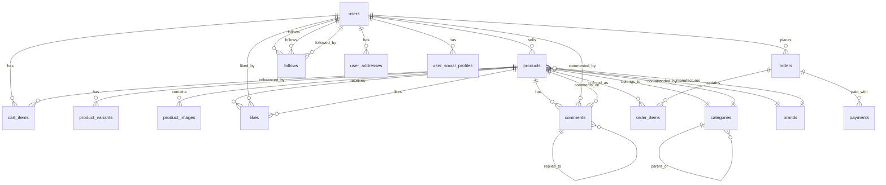

# 🗄️ Schéma de Base de Données - SocialCart

## Vue d'ensemble

SocialCart utilise **PostgreSQL** via Supabase avec une architecture relationnelle optimisée pour le commerce social. Ce document décrit la structure complète de la base de données.

## 📊 Diagramme ERD



## 👤 Tables Utilisateurs

### `users` - Profils utilisateurs

```sql
CREATE TABLE users (
    id UUID PRIMARY KEY DEFAULT gen_random_uuid(),
    email VARCHAR(255) UNIQUE NOT NULL,
    username VARCHAR(50) UNIQUE NOT NULL,
    full_name VARCHAR(100),
    avatar_url TEXT,
    phone VARCHAR(20),
    date_of_birth DATE,
    gender VARCHAR(10) CHECK (gender IN ('male', 'female', 'other')),
    loyalty_points INTEGER DEFAULT 0,
    is_seller BOOLEAN DEFAULT FALSE,
    is_verified BOOLEAN DEFAULT FALSE,
    bio TEXT,
    location VARCHAR(100),
    website_url TEXT,
    instagram_handle VARCHAR(50),
    tiktok_handle VARCHAR(50),
    created_at TIMESTAMP WITH TIME ZONE DEFAULT NOW(),
    updated_at TIMESTAMP WITH TIME ZONE DEFAULT NOW()
);
```

**Description :** Table principale des utilisateurs avec toutes les informations de profil.

**Champs clés :**
- `id` : Identifiant unique UUID
- `email` : Email unique (utilisé pour l'auth Supabase)
- `username` : Nom d'utilisateur unique (affiché publiquement)
- `is_seller` : Indique si l'utilisateur peut vendre des produits
- `is_verified` : Badge de vérification pour les comptes importants
- `loyalty_points` : Système de points de fidélité

### `user_addresses` - Adresses utilisateurs

```sql
CREATE TABLE user_addresses (
    id UUID PRIMARY KEY DEFAULT gen_random_uuid(),
    user_id UUID REFERENCES users(id) ON DELETE CASCADE,
    type VARCHAR(20) DEFAULT 'shipping' CHECK (type IN ('shipping', 'billing')),
    is_default BOOLEAN DEFAULT FALSE,
    full_name VARCHAR(100) NOT NULL,
    company VARCHAR(100),
    address_line_1 VARCHAR(255) NOT NULL,
    address_line_2 VARCHAR(255),
    city VARCHAR(100) NOT NULL,
    state VARCHAR(100),
    postal_code VARCHAR(20) NOT NULL,
    country VARCHAR(100) NOT NULL,
    phone VARCHAR(20),
    created_at TIMESTAMP WITH TIME ZONE DEFAULT NOW(),
    updated_at TIMESTAMP WITH TIME ZONE DEFAULT NOW()
);
```

**Description :** Gestion des adresses de livraison et de facturation.

**Relations :**
- `user_id` → `users.id` (CASCADE DELETE)

### `user_social_profiles` - Profils sociaux

```sql
CREATE TABLE user_social_profiles (
    id UUID PRIMARY KEY DEFAULT gen_random_uuid(),
    user_id UUID REFERENCES users(id) ON DELETE CASCADE,
    platform VARCHAR(20) NOT NULL CHECK (platform IN ('instagram', 'tiktok', 'youtube', 'twitter')),
    handle VARCHAR(100) NOT NULL,
    url TEXT,
    followers_count INTEGER DEFAULT 0,
    verified BOOLEAN DEFAULT FALSE,
    created_at TIMESTAMP WITH TIME ZONE DEFAULT NOW(),
    updated_at TIMESTAMP WITH TIME ZONE DEFAULT NOW(),
    UNIQUE(user_id, platform)
);
```

**Description :** Liens vers les profils sociaux des utilisateurs.

## 🛍️ Tables Produits

### `categories` - Catégories produits

```sql
CREATE TABLE categories (
    id UUID PRIMARY KEY DEFAULT gen_random_uuid(),
    name VARCHAR(100) NOT NULL,
    slug VARCHAR(100) UNIQUE NOT NULL,
    description TEXT,
    image_url TEXT,
    parent_id UUID REFERENCES categories(id),
    sort_order INTEGER DEFAULT 0,
    is_active BOOLEAN DEFAULT TRUE,
    created_at TIMESTAMP WITH TIME ZONE DEFAULT NOW(),
    updated_at TIMESTAMP WITH TIME ZONE DEFAULT NOW()
);
```

**Description :** Hiérarchie des catégories avec support des sous-catégories.

**Relations :**
- `parent_id` → `categories.id` (auto-référence pour les sous-catégories)

### `brands` - Marques

```sql
CREATE TABLE brands (
    id UUID PRIMARY KEY DEFAULT gen_random_uuid(),
    name VARCHAR(100) NOT NULL,
    slug VARCHAR(100) UNIQUE NOT NULL,
    description TEXT,
    logo_url TEXT,
    website_url TEXT,
    is_active BOOLEAN DEFAULT TRUE,
    created_at TIMESTAMP WITH TIME ZONE DEFAULT NOW(),
    updated_at TIMESTAMP WITH TIME ZONE DEFAULT NOW()
);
```

**Description :** Catalogue des marques disponibles.

### `products` - Produits

```sql
CREATE TABLE products (
    id UUID PRIMARY KEY DEFAULT gen_random_uuid(),
    seller_id UUID REFERENCES users(id) ON DELETE CASCADE,
    category_id UUID REFERENCES categories(id),
    brand_id UUID REFERENCES brands(id),
    name VARCHAR(255) NOT NULL,
    slug VARCHAR(255) UNIQUE NOT NULL,
    description TEXT NOT NULL,
    short_description VARCHAR(500),
    sku VARCHAR(100) UNIQUE,
    price DECIMAL(10,2) NOT NULL,
    compare_price DECIMAL(10,2),
    cost_price DECIMAL(10,2),
    weight DECIMAL(8,2),
    dimensions JSONB, -- {length, width, height, unit}
    status VARCHAR(20) DEFAULT 'draft' CHECK (status IN ('draft', 'active', 'inactive', 'archived')),
    inventory_tracking BOOLEAN DEFAULT TRUE,
    inventory_quantity INTEGER DEFAULT 0,
    allow_backorder BOOLEAN DEFAULT FALSE,
    requires_shipping BOOLEAN DEFAULT TRUE,
    taxable BOOLEAN DEFAULT TRUE,
    tags TEXT[],
    meta_title VARCHAR(255),
    meta_description TEXT,
    primary_image_url TEXT,
    video_url TEXT,
    created_at TIMESTAMP WITH TIME ZONE DEFAULT NOW(),
    updated_at TIMESTAMP WITH TIME ZONE DEFAULT NOW()
);
```

**Description :** Table principale des produits avec toutes les informations e-commerce.

**Relations :**
- `seller_id` → `users.id` (CASCADE DELETE)
- `category_id` → `categories.id`
- `brand_id` → `brands.id`

**Champs spéciaux :**
- `dimensions` : JSONB pour stocker les dimensions (longueur, largeur, hauteur, unité)
- `tags` : Array de tags pour la recherche et le filtrage
- `status` : État du produit (brouillon, actif, inactif, archivé)

### `product_variants` - Variantes produits

```sql
CREATE TABLE product_variants (
    id UUID PRIMARY KEY DEFAULT gen_random_uuid(),
    product_id UUID REFERENCES products(id) ON DELETE CASCADE,
    name VARCHAR(100) NOT NULL, -- ex: "Taille", "Couleur"
    options TEXT[] NOT NULL, -- ex: ["S", "M", "L"], ["Rouge", "Bleu"]
    required BOOLEAN DEFAULT TRUE,
    created_at TIMESTAMP WITH TIME ZONE DEFAULT NOW()
);
```

**Description :** Définition des variantes disponibles pour un produit (taille, couleur, etc.).

**Relations :**
- `product_id` → `products.id` (CASCADE DELETE)

### `product_images` - Images produits

```sql
CREATE TABLE product_images (
    id UUID PRIMARY KEY DEFAULT gen_random_uuid(),
    product_id UUID REFERENCES products(id) ON DELETE CASCADE,
    url TEXT NOT NULL,
    alt_text VARCHAR(255),
    sort_order INTEGER DEFAULT 0,
    is_primary BOOLEAN DEFAULT FALSE,
    created_at TIMESTAMP WITH TIME ZONE DEFAULT NOW()
);
```

**Description :** Gestion des images multiples par produit.

**Relations :**
- `product_id` → `products.id` (CASCADE DELETE)

## 🛒 Tables E-commerce

### `cart_items` - Panier utilisateur

```sql
CREATE TABLE cart_items (
    id UUID PRIMARY KEY DEFAULT gen_random_uuid(),
    user_id UUID REFERENCES users(id) ON DELETE CASCADE,
    product_id UUID REFERENCES products(id) ON DELETE CASCADE,
    quantity INTEGER NOT NULL DEFAULT 1 CHECK (quantity > 0),
    selected_variants JSONB, -- {size: "L", color: "Blue"}
    created_at TIMESTAMP WITH TIME ZONE DEFAULT NOW(),
    updated_at TIMESTAMP WITH TIME ZONE DEFAULT NOW(),
    UNIQUE(user_id, product_id, selected_variants)
);
```

**Description :** Articles dans le panier utilisateur avec variantes sélectionnées.

**Relations :**
- `user_id` → `users.id` (CASCADE DELETE)
- `product_id` → `products.id` (CASCADE DELETE)

**Champs spéciaux :**
- `selected_variants` : JSONB pour stocker les options sélectionnées
- `UNIQUE` : Empêche les doublons avec les mêmes variantes

### `orders` - Commandes

```sql
CREATE TABLE orders (
    id UUID PRIMARY KEY DEFAULT gen_random_uuid(),
    user_id UUID REFERENCES users(id) ON DELETE CASCADE,
    order_number VARCHAR(50) UNIQUE NOT NULL,
    status VARCHAR(20) DEFAULT 'pending' CHECK (status IN ('pending', 'confirmed', 'processing', 'shipped', 'delivered', 'cancelled', 'refunded')),
    subtotal DECIMAL(10,2) NOT NULL,
    tax_amount DECIMAL(10,2) DEFAULT 0,
    shipping_amount DECIMAL(10,2) DEFAULT 0,
    discount_amount DECIMAL(10,2) DEFAULT 0,
    total DECIMAL(10,2) NOT NULL,
    currency VARCHAR(3) DEFAULT 'EUR',
    shipping_address JSONB NOT NULL,
    billing_address JSONB,
    notes TEXT,
    created_at TIMESTAMP WITH TIME ZONE DEFAULT NOW(),
    updated_at TIMESTAMP WITH TIME ZONE DEFAULT NOW()
);
```

**Description :** Commandes utilisateur avec informations de livraison et facturation.

**Relations :**
- `user_id` → `users.id` (CASCADE DELETE)

### `order_items` - Articles commandés

```sql
CREATE TABLE order_items (
    id UUID PRIMARY KEY DEFAULT gen_random_uuid(),
    order_id UUID REFERENCES orders(id) ON DELETE CASCADE,
    product_id UUID REFERENCES products(id),
    product_name VARCHAR(255) NOT NULL, -- Snapshot du nom au moment de la commande
    product_sku VARCHAR(100),
    quantity INTEGER NOT NULL CHECK (quantity > 0),
    unit_price DECIMAL(10,2) NOT NULL,
    total_price DECIMAL(10,2) NOT NULL,
    selected_variants JSONB,
    created_at TIMESTAMP WITH TIME ZONE DEFAULT NOW()
);
```

**Description :** Articles individuels dans une commande (snapshot des données produit).

**Relations :**
- `order_id` → `orders.id` (CASCADE DELETE)
- `product_id` → `products.id` (référence, pas CASCADE)

### `payments` - Paiements

```sql
CREATE TABLE payments (
    id UUID PRIMARY KEY DEFAULT gen_random_uuid(),
    order_id UUID REFERENCES orders(id) ON DELETE CASCADE,
    payment_method VARCHAR(50) NOT NULL, -- 'stripe', 'paypal', 'bank_transfer'
    payment_intent_id VARCHAR(255), -- ID Stripe ou autre
    amount DECIMAL(10,2) NOT NULL,
    currency VARCHAR(3) DEFAULT 'EUR',
    status VARCHAR(20) DEFAULT 'pending' CHECK (status IN ('pending', 'processing', 'succeeded', 'failed', 'cancelled', 'refunded')),
    failure_reason TEXT,
    processed_at TIMESTAMP WITH TIME ZONE,
    created_at TIMESTAMP WITH TIME ZONE DEFAULT NOW(),
    updated_at TIMESTAMP WITH TIME ZONE DEFAULT NOW()
);
```

**Description :** Gestion des paiements avec intégration Stripe.

**Relations :**
- `order_id` → `orders.id` (CASCADE DELETE)

## 👥 Tables Sociales

### `follows` - Relations de suivi

```sql
CREATE TABLE follows (
    id UUID PRIMARY KEY DEFAULT gen_random_uuid(),
    follower_id UUID REFERENCES users(id) ON DELETE CASCADE,
    following_id UUID REFERENCES users(id) ON DELETE CASCADE,
    created_at TIMESTAMP WITH TIME ZONE DEFAULT NOW(),
    UNIQUE(follower_id, following_id),
    CHECK(follower_id != following_id)
);
```

**Description :** Relations de suivi entre utilisateurs.

**Relations :**
- `follower_id` → `users.id` (CASCADE DELETE)
- `following_id` → `users.id` (CASCADE DELETE)

**Contraintes :**
- `UNIQUE` : Un utilisateur ne peut suivre qu'une fois
- `CHECK` : Un utilisateur ne peut pas se suivre lui-même

### `likes` - Likes sur produits

```sql
CREATE TABLE likes (
    id UUID PRIMARY KEY DEFAULT gen_random_uuid(),
    user_id UUID REFERENCES users(id) ON DELETE CASCADE,
    product_id UUID REFERENCES products(id) ON DELETE CASCADE,
    created_at TIMESTAMP WITH TIME ZONE DEFAULT NOW(),
    UNIQUE(user_id, product_id)
);
```

**Description :** Likes des utilisateurs sur les produits.

**Relations :**
- `user_id` → `users.id` (CASCADE DELETE)
- `product_id` → `products.id` (CASCADE DELETE)

### `comments` - Commentaires

```sql
CREATE TABLE comments (
    id UUID PRIMARY KEY DEFAULT gen_random_uuid(),
    user_id UUID REFERENCES users(id) ON DELETE CASCADE,
    product_id UUID REFERENCES products(id) ON DELETE CASCADE,
    parent_id UUID REFERENCES comments(id) ON DELETE CASCADE, -- Pour les réponses
    content TEXT NOT NULL CHECK (LENGTH(content) > 0 AND LENGTH(content) <= 1000),
    is_edited BOOLEAN DEFAULT FALSE,
    created_at TIMESTAMP WITH TIME ZONE DEFAULT NOW(),
    updated_at TIMESTAMP WITH TIME ZONE DEFAULT NOW()
);
```

**Description :** Système de commentaires avec support des réponses.

**Relations :**
- `user_id` → `users.id` (CASCADE DELETE)
- `product_id` → `products.id` (CASCADE DELETE)
- `parent_id` → `comments.id` (CASCADE DELETE pour les réponses)

### `shares` - Partages

```sql
CREATE TABLE shares (
    id UUID PRIMARY KEY DEFAULT gen_random_uuid(),
    user_id UUID REFERENCES users(id) ON DELETE CASCADE,
    product_id UUID REFERENCES products(id) ON DELETE CASCADE,
    platform VARCHAR(20) CHECK (platform IN ('instagram', 'tiktok', 'twitter', 'facebook', 'whatsapp', 'copy_link')),
    created_at TIMESTAMP WITH TIME ZONE DEFAULT NOW()
);
```

**Description :** Tracking des partages de produits sur différentes plateformes.

## 📊 Tables Analytics

### `product_views` - Vues produits

```sql
CREATE TABLE product_views (
    id UUID PRIMARY KEY DEFAULT gen_random_uuid(),
    product_id UUID REFERENCES products(id) ON DELETE CASCADE,
    user_id UUID REFERENCES users(id) ON DELETE SET NULL, -- Peut être NULL pour les visiteurs anonymes
    ip_address INET,
    user_agent TEXT,
    referrer TEXT,
    created_at TIMESTAMP WITH TIME ZONE DEFAULT NOW()
);
```

**Description :** Tracking des vues de produits pour les analytics.

### `user_sessions` - Sessions utilisateur

```sql
CREATE TABLE user_sessions (
    id UUID PRIMARY KEY DEFAULT gen_random_uuid(),
    user_id UUID REFERENCES users(id) ON DELETE CASCADE,
    session_token VARCHAR(255) UNIQUE NOT NULL,
    ip_address INET,
    user_agent TEXT,
    device_type VARCHAR(50), -- 'mobile', 'tablet', 'desktop'
    started_at TIMESTAMP WITH TIME ZONE DEFAULT NOW(),
    ended_at TIMESTAMP WITH TIME ZONE,
    is_active BOOLEAN DEFAULT TRUE
);
```

**Description :** Gestion des sessions utilisateur pour l'analytics.

## 🔒 Sécurité et Permissions

### Row Level Security (RLS)

```sql
-- Activer RLS sur toutes les tables
ALTER TABLE users ENABLE ROW LEVEL SECURITY;
ALTER TABLE products ENABLE ROW LEVEL SECURITY;
ALTER TABLE cart_items ENABLE ROW LEVEL SECURITY;
-- ... pour toutes les tables

-- Exemple de politique pour les produits (lecture publique)
CREATE POLICY "Products are viewable by everyone" ON products
    FOR SELECT USING (true);

-- Exemple de politique pour le panier (propriétaire uniquement)
CREATE POLICY "Users can view own cart" ON cart_items
    FOR SELECT USING (auth.uid() = user_id);

CREATE POLICY "Users can manage own cart" ON cart_items
    FOR ALL USING (auth.uid() = user_id);
```

### Politiques RLS principales

```sql
-- Users : Lecture publique des profils, modification de son propre profil
CREATE POLICY "Users can view profiles" ON users FOR SELECT USING (true);
CREATE POLICY "Users can update own profile" ON users FOR UPDATE USING (auth.uid() = id);

-- Products : Lecture publique, modification par le vendeur
CREATE POLICY "Products are viewable by everyone" ON products FOR SELECT USING (true);
CREATE POLICY "Sellers can manage their products" ON products FOR ALL USING (auth.uid() = seller_id);

-- Likes : Tout le monde peut liker
CREATE POLICY "Users can like products" ON likes FOR ALL USING (auth.uid() = user_id);

-- Comments : Lecture publique, écriture authentifiée
CREATE POLICY "Comments are viewable by everyone" ON comments FOR SELECT USING (true);
CREATE POLICY "Users can create comments" ON comments FOR INSERT WITH CHECK (auth.uid() = user_id);
CREATE POLICY "Users can update own comments" ON comments FOR UPDATE USING (auth.uid() = user_id);
```

## 📈 Index et Performance

### Index recommandés

```sql
-- Index pour les recherches fréquentes
CREATE INDEX idx_products_status ON products(status);
CREATE INDEX idx_products_seller ON products(seller_id);
CREATE INDEX idx_products_category ON products(category_id);
CREATE INDEX idx_products_price ON products(price);
CREATE INDEX idx_products_created_at ON products(created_at DESC);

-- Index pour les relations sociales
CREATE INDEX idx_follows_follower ON follows(follower_id);
CREATE INDEX idx_follows_following ON follows(following_id);
CREATE INDEX idx_likes_user ON likes(user_id);
CREATE INDEX idx_likes_product ON likes(product_id);

-- Index pour les commandes
CREATE INDEX idx_orders_user ON orders(user_id);
CREATE INDEX idx_orders_status ON orders(status);
CREATE INDEX idx_orders_created_at ON orders(created_at DESC);

-- Index pour les recherches textuelles
CREATE INDEX idx_products_search ON products USING gin(to_tsvector('french', name || ' ' || description));
CREATE INDEX idx_users_search ON users USING gin(to_tsvector('french', username || ' ' || full_name));
```

### Vues matérialisées pour les performances

```sql
-- Vue pour les statistiques des produits
CREATE MATERIALIZED VIEW product_stats AS
SELECT 
    p.id,
    p.name,
    COUNT(DISTINCT l.id) as likes_count,
    COUNT(DISTINCT c.id) as comments_count,
    COUNT(DISTINCT s.id) as shares_count,
    COUNT(DISTINCT oi.id) as purchases_count
FROM products p
LEFT JOIN likes l ON p.id = l.product_id
LEFT JOIN comments c ON p.id = c.product_id
LEFT JOIN shares s ON p.id = s.product_id
LEFT JOIN order_items oi ON p.id = oi.product_id
GROUP BY p.id, p.name;

-- Rafraîchir la vue matérialisée
REFRESH MATERIALIZED VIEW product_stats;
```

## 🔄 Triggers et Fonctions

### Triggers automatiques

```sql
-- Trigger pour updated_at automatique
CREATE OR REPLACE FUNCTION update_updated_at_column()
RETURNS TRIGGER AS $$
BEGIN
    NEW.updated_at = NOW();
    RETURN NEW;
END;
$$ language 'plpgsql';

-- Appliquer le trigger sur toutes les tables avec updated_at
CREATE TRIGGER update_users_updated_at BEFORE UPDATE ON users FOR EACH ROW EXECUTE FUNCTION update_updated_at_column();
CREATE TRIGGER update_products_updated_at BEFORE UPDATE ON products FOR EACH ROW EXECUTE FUNCTION update_updated_at_column();
-- ... pour toutes les autres tables

-- Trigger pour générer les numéros de commande
CREATE OR REPLACE FUNCTION generate_order_number()
RETURNS TRIGGER AS $$
BEGIN
    NEW.order_number = 'SC-' || TO_CHAR(NOW(), 'YYYYMMDD') || '-' || LPAD(nextval('order_sequence')::text, 4, '0');
    RETURN NEW;
END;
$$ language 'plpgsql';

CREATE SEQUENCE order_sequence START 1;
CREATE TRIGGER generate_order_number_trigger BEFORE INSERT ON orders FOR EACH ROW EXECUTE FUNCTION generate_order_number();
```

### Fonctions utilitaires

```sql
-- Fonction pour calculer le total du panier
CREATE OR REPLACE FUNCTION calculate_cart_total(user_uuid UUID)
RETURNS DECIMAL(10,2) AS $$
DECLARE
    total_amount DECIMAL(10,2) := 0;
BEGIN
    SELECT COALESCE(SUM(p.price * ci.quantity), 0)
    INTO total_amount
    FROM cart_items ci
    JOIN products p ON ci.product_id = p.id
    WHERE ci.user_id = user_uuid;
    
    RETURN total_amount;
END;
$$ LANGUAGE plpgsql;

-- Fonction pour obtenir les produits populaires
CREATE OR REPLACE FUNCTION get_popular_products(limit_count INTEGER DEFAULT 10)
RETURNS TABLE (
    product_id UUID,
    product_name VARCHAR(255),
    likes_count BIGINT,
    views_count BIGINT,
    total_score BIGINT
) AS $$
BEGIN
    RETURN QUERY
    SELECT 
        p.id,
        p.name,
        COUNT(l.id) as likes_count,
        COUNT(pv.id) as views_count,
        (COUNT(l.id) * 2 + COUNT(pv.id)) as total_score
    FROM products p
    LEFT JOIN likes l ON p.id = l.product_id
    LEFT JOIN product_views pv ON p.id = pv.product_id
    WHERE p.status = 'active'
    GROUP BY p.id, p.name
    ORDER BY total_score DESC
    LIMIT limit_count;
END;
$$ LANGUAGE plpgsql;
```

## 📊 Requêtes d'exemple

### Requêtes complexes fréquentes

```sql
-- Feed vidéo avec informations sociales
SELECT 
    p.*,
    u.username,
    u.avatar_url,
    COUNT(DISTINCT l.id) as likes_count,
    COUNT(DISTINCT c.id) as comments_count,
    CASE WHEN user_likes.id IS NOT NULL THEN true ELSE false END as is_liked_by_user
FROM products p
JOIN users u ON p.seller_id = u.id
LEFT JOIN likes l ON p.id = l.product_id
LEFT JOIN comments c ON p.id = c.product_id
LEFT JOIN likes user_likes ON p.id = user_likes.product_id AND user_likes.user_id = $1
WHERE p.status = 'active'
GROUP BY p.id, u.id, user_likes.id
ORDER BY p.created_at DESC;

-- Statistiques utilisateur
SELECT 
    u.id,
    u.username,
    COUNT(DISTINCT p.id) as products_count,
    COUNT(DISTINCT f1.id) as followers_count,
    COUNT(DISTINCT f2.id) as following_count,
    COUNT(DISTINCT o.id) as orders_count
FROM users u
LEFT JOIN products p ON u.id = p.seller_id AND p.status = 'active'
LEFT JOIN follows f1 ON u.id = f1.following_id
LEFT JOIN follows f2 ON u.id = f2.follower_id
LEFT JOIN orders o ON u.id = o.user_id
WHERE u.id = $1
GROUP BY u.id, u.username;

-- Top vendeurs du mois
SELECT 
    u.id,
    u.username,
    u.avatar_url,
    COUNT(DISTINCT o.id) as orders_count,
    SUM(o.total) as total_revenue
FROM users u
JOIN products p ON u.id = p.seller_id
JOIN order_items oi ON p.id = oi.product_id
JOIN orders o ON oi.order_id = o.id
WHERE o.created_at >= date_trunc('month', CURRENT_DATE)
    AND o.status IN ('delivered', 'shipped')
GROUP BY u.id, u.username, u.avatar_url
ORDER BY total_revenue DESC
LIMIT 10;
```

## 🔧 Maintenance et Optimisation

### Nettoyage des données

```sql
-- Supprimer les sessions expirées (plus de 30 jours)
DELETE FROM user_sessions 
WHERE ended_at < NOW() - INTERVAL '30 days' 
   OR (is_active = false AND started_at < NOW() - INTERVAL '7 days');

-- Supprimer les vues de produits anciennes (plus de 1 an)
DELETE FROM product_views 
WHERE created_at < NOW() - INTERVAL '1 year';

-- Archiver les commandes anciennes (plus de 2 ans)
UPDATE orders 
SET status = 'archived' 
WHERE status = 'delivered' 
  AND created_at < NOW() - INTERVAL '2 years';
```

### Monitoring et alertes

```sql
-- Vérifier la taille des tables
SELECT 
    schemaname,
    tablename,
    pg_size_pretty(pg_total_relation_size(schemaname||'.'||tablename)) as size
FROM pg_tables 
WHERE schemaname = 'public'
ORDER BY pg_total_relation_size(schemaname||'.'||tablename) DESC;

-- Vérifier les index non utilisés
SELECT 
    schemaname,
    tablename,
    indexname,
    idx_tup_read,
    idx_tup_fetch
FROM pg_stat_user_indexes 
WHERE idx_tup_read = 0 
  AND idx_tup_fetch = 0
ORDER BY schemaname, tablename;
```

---

Ce schéma de base de données est conçu pour supporter les fonctionnalités actuelles de SocialCart tout en permettant une évolution future vers des fonctionnalités plus avancées comme l'analytics en temps réel, la recommandation de produits, et l'intégration avec des services tiers.