# 🗄️ Schéma de Base de Données - SocialCart

## Vue d'ensemble

SocialCart utilise **PostgreSQL** via **Supabase** comme base de données principale. Le schéma est conçu pour supporter une plateforme de commerce social avec des fonctionnalités avancées de vidéo, d'interactions sociales, et de gestion d'entreprise.

## 📊 Diagramme ERD

```mermaid
erDiagram
    users {
        uuid id PK
        string email UK
        string username UK
        string full_name
        string avatar_url
        text bio
        string phone
        boolean is_verified
        boolean is_seller
        timestamp created_at
        timestamp updated_at
    }
    
    addresses {
        uuid id PK
        uuid user_id FK
        string type
        string street
        string city
        string state
        string postal_code
        string country
        boolean is_default
        timestamp created_at
        timestamp updated_at
    }
    
    categories {
        uuid id PK
        string name UK
        string slug UK
        text description
        string icon
        string color
        uuid parent_id FK
        integer sort_order
        boolean is_active
        timestamp created_at
        timestamp updated_at
    }
    
    brands {
        uuid id PK
        string name UK
        string slug UK
        text description
        string logo_url
        string website
        boolean is_verified
        timestamp created_at
        timestamp updated_at
    }
    
    products {
        uuid id PK
        uuid seller_id FK
        string name
        text description
        decimal price
        decimal compare_price
        string sku UK
        string status
        integer stock_quantity
        decimal weight
        string weight_unit
        jsonb dimensions
        jsonb seo
        jsonb metadata
        timestamp created_at
        timestamp updated_at
    }
    
    product_variants {
        uuid id PK
        uuid product_id FK
        string name
        jsonb attributes
        decimal price
        integer stock_quantity
        string sku UK
        string image_url
        boolean is_default
        timestamp created_at
        timestamp updated_at
    }
    
    product_media {
        uuid id PK
        uuid product_id FK
        string type
        string url
        string alt_text
        integer sort_order
        jsonb metadata
        timestamp created_at
    }
    
    cart_items {
        uuid id PK
        uuid user_id FK
        uuid product_id FK
        uuid variant_id FK
        integer quantity
        decimal price
        timestamp created_at
        timestamp updated_at
    }
    
    orders {
        uuid id PK
        string order_number UK
        uuid user_id FK
        uuid seller_id FK
        string status
        decimal subtotal
        decimal tax_amount
        decimal shipping_amount
        decimal total_amount
        jsonb shipping_address
        jsonb billing_address
        jsonb payment_info
        text notes
        timestamp created_at
        timestamp updated_at
    }
    
    order_items {
        uuid id PK
        uuid order_id FK
        uuid product_id FK
        uuid variant_id FK
        string product_name
        string variant_name
        integer quantity
        decimal unit_price
        decimal total_price
        timestamp created_at
    }
    
    payments {
        uuid id PK
        uuid order_id FK
        string payment_method
        string status
        decimal amount
        string transaction_id
        jsonb payment_data
        timestamp created_at
        timestamp updated_at
    }
    
    live_streams {
        uuid id PK
        uuid seller_id FK
        string title
        text description
        string stream_key
        string status
        timestamp scheduled_at
        timestamp started_at
        timestamp ended_at
        jsonb metadata
        timestamp created_at
        timestamp updated_at
    }
    
    reviews {
        uuid id PK
        uuid user_id FK
        uuid product_id FK
        uuid order_id FK
        integer rating
        text comment
        jsonb media_urls
        boolean is_verified_purchase
        timestamp created_at
        timestamp updated_at
    }
    
    wishlists {
        uuid id PK
        uuid user_id FK
        uuid product_id FK
        timestamp created_at
    }
    
    coupons {
        uuid id PK
        string code UK
        string type
        decimal value
        decimal minimum_amount
        integer usage_limit
        integer used_count
        timestamp valid_from
        timestamp valid_until
        boolean is_active
        timestamp created_at
        timestamp updated_at
    }
    
    notifications {
        uuid id PK
        uuid user_id FK
        string type
        string title
        text message
        jsonb data
        boolean is_read
        timestamp created_at
    }
    
    follows {
        uuid id PK
        uuid follower_id FK
        uuid following_id FK
        timestamp created_at
    }
    
    likes {
        uuid id PK
        uuid user_id FK
        uuid product_id FK
        timestamp created_at
    }
    
    comments {
        uuid id PK
        uuid user_id FK
        uuid product_id FK
        text content
        uuid parent_id FK
        timestamp created_at
        timestamp updated_at
    }
    
    comment_likes {
        uuid id PK
        uuid user_id FK
        uuid comment_id FK
        timestamp created_at
    }
    
    product_views {
        uuid id PK
        uuid user_id FK
        uuid product_id FK
        string ip_address
        string user_agent
        timestamp created_at
    }
    
    product_shares {
        uuid id PK
        uuid user_id FK
        uuid product_id FK
        string platform
        timestamp created_at
    }
    
    loyalty_transactions {
        uuid id PK
        uuid user_id FK
        string type
        integer points
        text description
        jsonb metadata
        timestamp created_at
    }
    
    user_loyalty_points {
        uuid id PK
        uuid user_id FK
        integer total_points
        integer available_points
        integer used_points
        timestamp created_at
        timestamp updated_at
    }

    users ||--o{ addresses : "has"
    users ||--o{ products : "sells"
    users ||--o{ cart_items : "has"
    users ||--o{ orders : "places"
    users ||--o{ reviews : "writes"
    users ||--o{ wishlists : "has"
    users ||--o{ follows : "follows"
    users ||--o{ likes : "likes"
    users ||--o{ comments : "writes"
    users ||--o{ product_views : "views"
    users ||--o{ product_shares : "shares"
    users ||--o{ loyalty_transactions : "earns"
    users ||--o{ user_loyalty_points : "has"
    users ||--o{ notifications : "receives"
    
    categories ||--o{ categories : "parent"
    categories ||--o{ products : "categorizes"
    
    brands ||--o{ products : "brands"
    
    products ||--o{ product_variants : "has"
    products ||--o{ product_media : "has"
    products ||--o{ cart_items : "in"
    products ||--o{ order_items : "in"
    products ||--o{ reviews : "receives"
    products ||--o{ wishlists : "in"
    products ||--o{ likes : "receives"
    products ||--o{ comments : "receives"
    products ||--o{ product_views : "receives"
    products ||--o{ product_shares : "receives"
    
    orders ||--o{ order_items : "contains"
    orders ||--o{ payments : "has"
    
    comments ||--o{ comments : "replies"
    comments ||--o{ comment_likes : "receives"
```



## 📋 Tables Principales

### 👤 Utilisateurs et Authentification

#### `users`
Table principale des utilisateurs avec authentification Supabase.

```sql
CREATE TABLE users (
    id UUID PRIMARY KEY DEFAULT gen_random_uuid(),
    email VARCHAR(255) UNIQUE NOT NULL,
    username VARCHAR(50) UNIQUE NOT NULL,
    full_name VARCHAR(255),
    avatar_url TEXT,
    bio TEXT,
    phone VARCHAR(20),
    is_verified BOOLEAN DEFAULT FALSE,
    is_seller BOOLEAN DEFAULT FALSE,
    created_at TIMESTAMP WITH TIME ZONE DEFAULT NOW(),
    updated_at TIMESTAMP WITH TIME ZONE DEFAULT NOW()
);
```

**Champs clés :**
- `id` : Identifiant unique (UUID)
- `email` : Email unique pour l'authentification
- `username` : Nom d'utilisateur unique
- `is_seller` : Indique si l'utilisateur peut vendre
- `is_verified` : Statut de vérification du compte

#### `addresses`
Adresses des utilisateurs (livraison et facturation).

```sql
CREATE TABLE addresses (
    id UUID PRIMARY KEY DEFAULT gen_random_uuid(),
    user_id UUID REFERENCES users(id) ON DELETE CASCADE,
    type VARCHAR(20) NOT NULL CHECK (type IN ('shipping', 'billing')),
    street VARCHAR(255) NOT NULL,
    city VARCHAR(100) NOT NULL,
    state VARCHAR(100),
    postal_code VARCHAR(20) NOT NULL,
    country VARCHAR(100) NOT NULL DEFAULT 'France',
    is_default BOOLEAN DEFAULT FALSE,
    created_at TIMESTAMP WITH TIME ZONE DEFAULT NOW(),
    updated_at TIMESTAMP WITH TIME ZONE DEFAULT NOW()
);
```

### 🛍️ Produits et Catalogue

#### `products`
Table principale des produits avec toutes les informations commerciales.

```sql
CREATE TABLE products (
    id UUID PRIMARY KEY DEFAULT gen_random_uuid(),
    seller_id UUID REFERENCES users(id) ON DELETE CASCADE,
    name VARCHAR(255) NOT NULL,
    description TEXT,
    price DECIMAL(10,2) NOT NULL,
    compare_price DECIMAL(10,2),
    sku VARCHAR(100) UNIQUE,
    status VARCHAR(20) DEFAULT 'draft' CHECK (status IN ('draft', 'active', 'inactive', 'archived')),
    stock_quantity INTEGER DEFAULT 0,
    weight DECIMAL(8,2),
    weight_unit VARCHAR(10) DEFAULT 'kg',
    dimensions JSONB,
    seo JSONB,
    metadata JSONB,
    created_at TIMESTAMP WITH TIME ZONE DEFAULT NOW(),
    updated_at TIMESTAMP WITH TIME ZONE DEFAULT NOW()
);
```

**Champs clés :**
- `seller_id` : Référence vers l'utilisateur vendeur
- `price` : Prix principal du produit
- `compare_price` : Prix barré (ancien prix)
- `status` : Statut du produit (draft, active, inactive, archived)
- `stock_quantity` : Quantité en stock
- `dimensions` : Dimensions du produit (JSON)
- `seo` : Données SEO (JSON)
- `metadata` : Métadonnées personnalisées (JSON)

#### `product_variants`
Variantes des produits (couleur, taille, etc.).

```sql
CREATE TABLE product_variants (
    id UUID PRIMARY KEY DEFAULT gen_random_uuid(),
    product_id UUID REFERENCES products(id) ON DELETE CASCADE,
    name VARCHAR(255) NOT NULL,
    attributes JSONB NOT NULL,
    price DECIMAL(10,2),
    stock_quantity INTEGER DEFAULT 0,
    sku VARCHAR(100) UNIQUE,
    image_url TEXT,
    is_default BOOLEAN DEFAULT FALSE,
    created_at TIMESTAMP WITH TIME ZONE DEFAULT NOW(),
    updated_at TIMESTAMP WITH TIME ZONE DEFAULT NOW()
);
```

**Champs clés :**
- `attributes` : Attributs de la variante (JSON) ex: `{"color": "red", "size": "M"}`
- `price` : Prix spécifique à la variante (optionnel)
- `is_default` : Variante par défaut du produit

#### `product_media`
Médias associés aux produits (images, vidéos).

```sql
CREATE TABLE product_media (
    id UUID PRIMARY KEY DEFAULT gen_random_uuid(),
    product_id UUID REFERENCES products(id) ON DELETE CASCADE,
    type VARCHAR(20) NOT NULL CHECK (type IN ('image', 'video', '360')),
    url TEXT NOT NULL,
    alt_text VARCHAR(255),
    sort_order INTEGER DEFAULT 0,
    metadata JSONB,
    created_at TIMESTAMP WITH TIME ZONE DEFAULT NOW()
);
```

### 🛒 Panier et Commandes

#### `cart_items`
Articles dans le panier des utilisateurs.

```sql
CREATE TABLE cart_items (
    id UUID PRIMARY KEY DEFAULT gen_random_uuid(),
    user_id UUID REFERENCES users(id) ON DELETE CASCADE,
    product_id UUID REFERENCES products(id) ON DELETE CASCADE,
    variant_id UUID REFERENCES product_variants(id) ON DELETE CASCADE,
    quantity INTEGER NOT NULL DEFAULT 1,
    price DECIMAL(10,2) NOT NULL,
    created_at TIMESTAMP WITH TIME ZONE DEFAULT NOW(),
    updated_at TIMESTAMP WITH TIME ZONE DEFAULT NOW()
);
```

#### `orders`
Commandes des utilisateurs.

```sql
CREATE TABLE orders (
    id UUID PRIMARY KEY DEFAULT gen_random_uuid(),
    order_number VARCHAR(50) UNIQUE NOT NULL,
    user_id UUID REFERENCES users(id) ON DELETE CASCADE,
    seller_id UUID REFERENCES users(id) ON DELETE CASCADE,
    status VARCHAR(20) DEFAULT 'pending' CHECK (status IN ('pending', 'confirmed', 'processing', 'shipped', 'delivered', 'cancelled', 'refunded')),
    subtotal DECIMAL(10,2) NOT NULL,
    tax_amount DECIMAL(10,2) DEFAULT 0,
    shipping_amount DECIMAL(10,2) DEFAULT 0,
    total_amount DECIMAL(10,2) NOT NULL,
    shipping_address JSONB NOT NULL,
    billing_address JSONB NOT NULL,
    payment_info JSONB,
    notes TEXT,
    created_at TIMESTAMP WITH TIME ZONE DEFAULT NOW(),
    updated_at TIMESTAMP WITH TIME ZONE DEFAULT NOW()
);
```

**Champs clés :**
- `order_number` : Numéro de commande unique généré automatiquement
- `status` : Statut de la commande
- `shipping_address` : Adresse de livraison (JSON)
- `billing_address` : Adresse de facturation (JSON)
- `payment_info` : Informations de paiement (JSON)

#### `order_items`
Articles dans les commandes.

```sql
CREATE TABLE order_items (
    id UUID PRIMARY KEY DEFAULT gen_random_uuid(),
    order_id UUID REFERENCES orders(id) ON DELETE CASCADE,
    product_id UUID REFERENCES products(id) ON DELETE CASCADE,
    variant_id UUID REFERENCES product_variants(id) ON DELETE CASCADE,
    product_name VARCHAR(255) NOT NULL,
    variant_name VARCHAR(255),
    quantity INTEGER NOT NULL,
    unit_price DECIMAL(10,2) NOT NULL,
    total_price DECIMAL(10,2) NOT NULL,
    created_at TIMESTAMP WITH TIME ZONE DEFAULT NOW()
);
```

### 💳 Paiements

#### `payments`
Transactions de paiement.

```sql
CREATE TABLE payments (
    id UUID PRIMARY KEY DEFAULT gen_random_uuid(),
    order_id UUID REFERENCES orders(id) ON DELETE CASCADE,
    payment_method VARCHAR(50) NOT NULL,
    status VARCHAR(20) DEFAULT 'pending' CHECK (status IN ('pending', 'processing', 'completed', 'failed', 'cancelled', 'refunded')),
    amount DECIMAL(10,2) NOT NULL,
    transaction_id VARCHAR(255),
    payment_data JSONB,
    created_at TIMESTAMP WITH TIME ZONE DEFAULT NOW(),
    updated_at TIMESTAMP WITH TIME ZONE DEFAULT NOW()
);
```

### 🎥 Streaming et Médias

#### `live_streams`
Streams en direct des vendeurs.

```sql
CREATE TABLE live_streams (
    id UUID PRIMARY KEY DEFAULT gen_random_uuid(),
    seller_id UUID REFERENCES users(id) ON DELETE CASCADE,
    title VARCHAR(255) NOT NULL,
    description TEXT,
    stream_key VARCHAR(255) UNIQUE NOT NULL,
    status VARCHAR(20) DEFAULT 'scheduled' CHECK (status IN ('scheduled', 'live', 'ended', 'cancelled')),
    scheduled_at TIMESTAMP WITH TIME ZONE,
    started_at TIMESTAMP WITH TIME ZONE,
    ended_at TIMESTAMP WITH TIME ZONE,
    metadata JSONB,
    created_at TIMESTAMP WITH TIME ZONE DEFAULT NOW(),
    updated_at TIMESTAMP WITH TIME ZONE DEFAULT NOW()
);
```

### ⭐ Avis et Interactions

#### `reviews`
Avis des utilisateurs sur les produits.

```sql
CREATE TABLE reviews (
    id UUID PRIMARY KEY DEFAULT gen_random_uuid(),
    user_id UUID REFERENCES users(id) ON DELETE CASCADE,
    product_id UUID REFERENCES products(id) ON DELETE CASCADE,
    order_id UUID REFERENCES orders(id) ON DELETE CASCADE,
    rating INTEGER NOT NULL CHECK (rating >= 1 AND rating <= 5),
    comment TEXT,
    media_urls JSONB,
    is_verified_purchase BOOLEAN DEFAULT FALSE,
    created_at TIMESTAMP WITH TIME ZONE DEFAULT NOW(),
    updated_at TIMESTAMP WITH TIME ZONE DEFAULT NOW()
);
```

#### `likes`
Likes des utilisateurs sur les produits.

```sql
CREATE TABLE likes (
    id UUID PRIMARY KEY DEFAULT gen_random_uuid(),
    user_id UUID REFERENCES users(id) ON DELETE CASCADE,
    product_id UUID REFERENCES products(id) ON DELETE CASCADE,
    created_at TIMESTAMP WITH TIME ZONE DEFAULT NOW(),
    UNIQUE(user_id, product_id)
);
```

#### `comments`
Commentaires sur les produits.

```sql
CREATE TABLE comments (
    id UUID PRIMARY KEY DEFAULT gen_random_uuid(),
    user_id UUID REFERENCES users(id) ON DELETE CASCADE,
    product_id UUID REFERENCES products(id) ON DELETE CASCADE,
    content TEXT NOT NULL,
    parent_id UUID REFERENCES comments(id) ON DELETE CASCADE,
    created_at TIMESTAMP WITH TIME ZONE DEFAULT NOW(),
    updated_at TIMESTAMP WITH TIME ZONE DEFAULT NOW()
);
```

### 👥 Social et Suivi

#### `follows`
Relations de suivi entre utilisateurs.

```sql
CREATE TABLE follows (
    id UUID PRIMARY KEY DEFAULT gen_random_uuid(),
    follower_id UUID REFERENCES users(id) ON DELETE CASCADE,
    following_id UUID REFERENCES users(id) ON DELETE CASCADE,
    created_at TIMESTAMP WITH TIME ZONE DEFAULT NOW(),
    UNIQUE(follower_id, following_id)
);
```

#### `wishlists`
Listes de souhaits des utilisateurs.

```sql
CREATE TABLE wishlists (
    id UUID PRIMARY KEY DEFAULT gen_random_uuid(),
    user_id UUID REFERENCES users(id) ON DELETE CASCADE,
    product_id UUID REFERENCES products(id) ON DELETE CASCADE,
    created_at TIMESTAMP WITH TIME ZONE DEFAULT NOW(),
    UNIQUE(user_id, product_id)
);
```

### 🎁 Fidélité et Coupons

#### `loyalty_transactions`
Transactions du système de fidélité.

```sql
CREATE TABLE loyalty_transactions (
    id UUID PRIMARY KEY DEFAULT gen_random_uuid(),
    user_id UUID REFERENCES users(id) ON DELETE CASCADE,
    type VARCHAR(50) NOT NULL,
    points INTEGER NOT NULL,
    description TEXT,
    metadata JSONB,
    created_at TIMESTAMP WITH TIME ZONE DEFAULT NOW()
);
```

#### `user_loyalty_points`
Points de fidélité des utilisateurs.

```sql
CREATE TABLE user_loyalty_points (
    id UUID PRIMARY KEY DEFAULT gen_random_uuid(),
    user_id UUID REFERENCES users(id) ON DELETE CASCADE,
    total_points INTEGER DEFAULT 0,
    available_points INTEGER DEFAULT 0,
    used_points INTEGER DEFAULT 0,
    created_at TIMESTAMP WITH TIME ZONE DEFAULT NOW(),
    updated_at TIMESTAMP WITH TIME ZONE DEFAULT NOW(),
    UNIQUE(user_id)
);
```

#### `coupons`
Coupons de réduction.

```sql
CREATE TABLE coupons (
    id UUID PRIMARY KEY DEFAULT gen_random_uuid(),
    code VARCHAR(50) UNIQUE NOT NULL,
    type VARCHAR(20) NOT NULL CHECK (type IN ('percentage', 'fixed')),
    value DECIMAL(10,2) NOT NULL,
    minimum_amount DECIMAL(10,2),
    usage_limit INTEGER,
    used_count INTEGER DEFAULT 0,
    valid_from TIMESTAMP WITH TIME ZONE DEFAULT NOW(),
    valid_until TIMESTAMP WITH TIME ZONE,
    is_active BOOLEAN DEFAULT TRUE,
    created_at TIMESTAMP WITH TIME ZONE DEFAULT NOW(),
    updated_at TIMESTAMP WITH TIME ZONE DEFAULT NOW()
);
```

### 📊 Analytics et Tracking

#### `product_views`
Vues des produits pour l'analytics.

```sql
CREATE TABLE product_views (
    id UUID PRIMARY KEY DEFAULT gen_random_uuid(),
    user_id UUID REFERENCES users(id) ON DELETE CASCADE,
    product_id UUID REFERENCES products(id) ON DELETE CASCADE,
    ip_address INET,
    user_agent TEXT,
    created_at TIMESTAMP WITH TIME ZONE DEFAULT NOW()
);
```

#### `product_shares`
Partages de produits sur les réseaux sociaux.

```sql
CREATE TABLE product_shares (
    id UUID PRIMARY KEY DEFAULT gen_random_uuid(),
    user_id UUID REFERENCES users(id) ON DELETE CASCADE,
    product_id UUID REFERENCES products(id) ON DELETE CASCADE,
    platform VARCHAR(50) NOT NULL,
    created_at TIMESTAMP WITH TIME ZONE DEFAULT NOW()
);
```

### 🔔 Notifications

#### `notifications`
Notifications des utilisateurs.

```sql
CREATE TABLE notifications (
    id UUID PRIMARY KEY DEFAULT gen_random_uuid(),
    user_id UUID REFERENCES users(id) ON DELETE CASCADE,
    type VARCHAR(50) NOT NULL,
    title VARCHAR(255) NOT NULL,
    message TEXT NOT NULL,
    data JSONB,
    is_read BOOLEAN DEFAULT FALSE,
    created_at TIMESTAMP WITH TIME ZONE DEFAULT NOW()
);
```

## 🔗 Relations et Contraintes

### Relations Principales

1. **Users → Products** : Un utilisateur peut vendre plusieurs produits
2. **Products → Variants** : Un produit peut avoir plusieurs variantes
3. **Users → Orders** : Un utilisateur peut passer plusieurs commandes
4. **Orders → Order Items** : Une commande contient plusieurs articles
5. **Users → Cart Items** : Un utilisateur a un panier avec plusieurs articles
6. **Products → Reviews** : Un produit peut recevoir plusieurs avis
7. **Users → Follows** : Relations de suivi entre utilisateurs

### Contraintes d'Intégrité

```sql
-- Contraintes de clés étrangères
ALTER TABLE products ADD CONSTRAINT fk_products_seller 
    FOREIGN KEY (seller_id) REFERENCES users(id) ON DELETE CASCADE;

ALTER TABLE cart_items ADD CONSTRAINT fk_cart_items_user 
    FOREIGN KEY (user_id) REFERENCES users(id) ON DELETE CASCADE;

ALTER TABLE cart_items ADD CONSTRAINT fk_cart_items_product 
    FOREIGN KEY (product_id) REFERENCES products(id) ON DELETE CASCADE;

-- Contraintes d'unicité
ALTER TABLE users ADD CONSTRAINT uk_users_email UNIQUE (email);
ALTER TABLE users ADD CONSTRAINT uk_users_username UNIQUE (username);
ALTER TABLE products ADD CONSTRAINT uk_products_sku UNIQUE (sku);
ALTER TABLE orders ADD CONSTRAINT uk_orders_number UNIQUE (order_number);

-- Contraintes de vérification
ALTER TABLE products ADD CONSTRAINT ck_products_price CHECK (price > 0);
ALTER TABLE reviews ADD CONSTRAINT ck_reviews_rating CHECK (rating >= 1 AND rating <= 5);
ALTER TABLE cart_items ADD CONSTRAINT ck_cart_items_quantity CHECK (quantity > 0);
```

## 🔒 Sécurité et RLS (Row Level Security)

### Politiques RLS Principales

```sql
-- Activer RLS sur toutes les tables
ALTER TABLE users ENABLE ROW LEVEL SECURITY;
ALTER TABLE products ENABLE ROW LEVEL SECURITY;
ALTER TABLE cart_items ENABLE ROW LEVEL SECURITY;
ALTER TABLE orders ENABLE ROW LEVEL SECURITY;

-- Politiques pour les utilisateurs
CREATE POLICY "Users can view their own profile" ON users
    FOR SELECT USING (auth.uid() = id);

CREATE POLICY "Users can update their own profile" ON users
    FOR UPDATE USING (auth.uid() = id);

-- Politiques pour les produits
CREATE POLICY "Anyone can view active products" ON products
    FOR SELECT USING (status = 'active');

CREATE POLICY "Sellers can manage their own products" ON products
    FOR ALL USING (auth.uid() = seller_id);

-- Politiques pour le panier
CREATE POLICY "Users can manage their own cart" ON cart_items
    FOR ALL USING (auth.uid() = user_id);

-- Politiques pour les commandes
CREATE POLICY "Users can view their own orders" ON orders
    FOR SELECT USING (auth.uid() = user_id);

CREATE POLICY "Sellers can view orders for their products" ON orders
    FOR SELECT USING (auth.uid() = seller_id);
```

## 📈 Index Recommandés

### Index de Performance

```sql
-- Index pour les requêtes fréquentes
CREATE INDEX idx_products_seller_status ON products(seller_id, status);
CREATE INDEX idx_products_category ON products(category_id);
CREATE INDEX idx_products_price ON products(price);
CREATE INDEX idx_products_created_at ON products(created_at DESC);

-- Index pour le panier
CREATE INDEX idx_cart_items_user ON cart_items(user_id);
CREATE INDEX idx_cart_items_product ON cart_items(product_id);

-- Index pour les commandes
CREATE INDEX idx_orders_user ON orders(user_id);
CREATE INDEX idx_orders_seller ON orders(seller_id);
CREATE INDEX idx_orders_status ON orders(status);
CREATE INDEX idx_orders_created_at ON orders(created_at DESC);

-- Index pour les interactions sociales
CREATE INDEX idx_likes_user ON likes(user_id);
CREATE INDEX idx_likes_product ON likes(product_id);
CREATE INDEX idx_follows_follower ON follows(follower_id);
CREATE INDEX idx_follows_following ON follows(following_id);

-- Index pour l'analytics
CREATE INDEX idx_product_views_product ON product_views(product_id);
CREATE INDEX idx_product_views_created_at ON product_views(created_at DESC);
CREATE INDEX idx_reviews_product ON reviews(product_id);
CREATE INDEX idx_reviews_rating ON reviews(rating);
```

### Index Composés

```sql
-- Index composés pour les requêtes complexes
CREATE INDEX idx_products_search ON products USING gin(to_tsvector('french', name || ' ' || description));
CREATE INDEX idx_products_filters ON products(status, price, created_at) WHERE status = 'active';
CREATE INDEX idx_orders_user_status ON orders(user_id, status, created_at);
CREATE INDEX idx_cart_items_user_product ON cart_items(user_id, product_id);
```

## 🔄 Triggers et Fonctions

### Triggers de Mise à Jour

```sql
-- Fonction pour mettre à jour updated_at
CREATE OR REPLACE FUNCTION update_updated_at_column()
RETURNS TRIGGER AS $$
BEGIN
    NEW.updated_at = NOW();
    RETURN NEW;
END;
$$ language 'plpgsql';

-- Appliquer le trigger sur toutes les tables
CREATE TRIGGER update_users_updated_at BEFORE UPDATE ON users
    FOR EACH ROW EXECUTE FUNCTION update_updated_at_column();

CREATE TRIGGER update_products_updated_at BEFORE UPDATE ON products
    FOR EACH ROW EXECUTE FUNCTION update_updated_at_column();

CREATE TRIGGER update_orders_updated_at BEFORE UPDATE ON orders
    FOR EACH ROW EXECUTE FUNCTION update_updated_at_column();
```

### Fonctions Métier

```sql
-- Fonction pour générer le numéro de commande
CREATE OR REPLACE FUNCTION generate_order_number()
RETURNS TRIGGER AS $$
BEGIN
    NEW.order_number = 'SC-' || TO_CHAR(NOW(), 'YYYYMMDD') || '-' || LPAD(nextval('order_sequence')::text, 6, '0');
    RETURN NEW;
END;
$$ language 'plpgsql';

-- Séquence pour les numéros de commande
CREATE SEQUENCE order_sequence START 1;

-- Trigger pour générer le numéro de commande
CREATE TRIGGER generate_order_number_trigger BEFORE INSERT ON orders
    FOR EACH ROW EXECUTE FUNCTION generate_order_number();
```

## 📊 Vues Matérialisées

### Vues pour l'Analytics

```sql
-- Vue des statistiques des produits
CREATE MATERIALIZED VIEW product_stats AS
SELECT 
    p.id,
    p.name,
    p.price,
    p.status,
    COUNT(DISTINCT pv.id) as view_count,
    COUNT(DISTINCT l.id) as like_count,
    COUNT(DISTINCT c.id) as comment_count,
    COUNT(DISTINCT r.id) as review_count,
    AVG(r.rating) as avg_rating,
    COUNT(DISTINCT oi.id) as order_count,
    SUM(oi.quantity) as total_sold
FROM products p
LEFT JOIN product_views pv ON p.id = pv.product_id
LEFT JOIN likes l ON p.id = l.product_id
LEFT JOIN comments c ON p.id = c.product_id
LEFT JOIN reviews r ON p.id = r.product_id
LEFT JOIN order_items oi ON p.id = oi.product_id
GROUP BY p.id, p.name, p.price, p.status;

-- Rafraîchir la vue périodiquement
REFRESH MATERIALIZED VIEW product_stats;
```

### Vues pour les Dashboards

```sql
-- Vue des statistiques des vendeurs
CREATE MATERIALIZED VIEW seller_stats AS
SELECT 
    u.id as seller_id,
    u.username,
    u.full_name,
    COUNT(DISTINCT p.id) as total_products,
    COUNT(DISTINCT CASE WHEN p.status = 'active' THEN p.id END) as active_products,
    COUNT(DISTINCT o.id) as total_orders,
    SUM(o.total_amount) as total_revenue,
    AVG(r.rating) as avg_rating,
    COUNT(DISTINCT f.follower_id) as followers_count
FROM users u
LEFT JOIN products p ON u.id = p.seller_id
LEFT JOIN orders o ON u.id = o.seller_id
LEFT JOIN reviews r ON p.id = r.product_id
LEFT JOIN follows f ON u.id = f.following_id
WHERE u.is_seller = true
GROUP BY u.id, u.username, u.full_name;
```

## 🔧 Fonctions Utilitaires

### Fonctions de Recherche

```sql
-- Fonction de recherche de produits
CREATE OR REPLACE FUNCTION search_products(
    search_term TEXT,
    category_id UUID DEFAULT NULL,
    min_price DECIMAL DEFAULT NULL,
    max_price DECIMAL DEFAULT NULL,
    limit_count INTEGER DEFAULT 20,
    offset_count INTEGER DEFAULT 0
)
RETURNS TABLE (
    id UUID,
    name VARCHAR,
    description TEXT,
    price DECIMAL,
    image_url TEXT,
    seller_username VARCHAR,
    rating_avg DECIMAL,
    review_count BIGINT
) AS $$
BEGIN
    RETURN QUERY
    SELECT 
        p.id,
        p.name,
        p.description,
        p.price,
        pm.url as image_url,
        u.username as seller_username,
        AVG(r.rating) as rating_avg,
        COUNT(r.id) as review_count
    FROM products p
    JOIN users u ON p.seller_id = u.id
    LEFT JOIN product_media pm ON p.id = pm.product_id AND pm.type = 'image'
    LEFT JOIN reviews r ON p.id = r.product_id
    WHERE 
        p.status = 'active'
        AND (search_term IS NULL OR to_tsvector('french', p.name || ' ' || p.description) @@ plainto_tsquery('french', search_term))
        AND (category_id IS NULL OR p.category_id = category_id)
        AND (min_price IS NULL OR p.price >= min_price)
        AND (max_price IS NULL OR p.price <= max_price)
    GROUP BY p.id, p.name, p.description, p.price, pm.url, u.username
    ORDER BY rating_avg DESC NULLS LAST, p.created_at DESC
    LIMIT limit_count OFFSET offset_count;
END;
$$ LANGUAGE plpgsql;
```

### Fonctions de Gestion du Panier

```sql
-- Fonction pour ajouter un article au panier
CREATE OR REPLACE FUNCTION add_to_cart(
    p_user_id UUID,
    p_product_id UUID,
    p_variant_id UUID DEFAULT NULL,
    p_quantity INTEGER DEFAULT 1
)
RETURNS UUID AS $$
DECLARE
    cart_item_id UUID;
    product_price DECIMAL;
BEGIN
    -- Récupérer le prix du produit ou de la variante
    IF p_variant_id IS NOT NULL THEN
        SELECT price INTO product_price FROM product_variants WHERE id = p_variant_id;
    ELSE
        SELECT price INTO product_price FROM products WHERE id = p_product_id;
    END IF;
    
    -- Vérifier si l'article existe déjà dans le panier
    SELECT id INTO cart_item_id FROM cart_items 
    WHERE user_id = p_user_id AND product_id = p_product_id AND variant_id = p_variant_id;
    
    IF cart_item_id IS NOT NULL THEN
        -- Mettre à jour la quantité
        UPDATE cart_items 
        SET quantity = quantity + p_quantity, updated_at = NOW()
        WHERE id = cart_item_id;
    ELSE
        -- Créer un nouvel article
        INSERT INTO cart_items (user_id, product_id, variant_id, quantity, price)
        VALUES (p_user_id, p_product_id, p_variant_id, p_quantity, product_price)
        RETURNING id INTO cart_item_id;
    END IF;
    
    RETURN cart_item_id;
END;
$$ LANGUAGE plpgsql;
```

## 📝 Exemples de Requêtes

### Requêtes Fréquentes

```sql
-- Récupérer les produits populaires
SELECT 
    p.id,
    p.name,
    p.price,
    pm.url as image_url,
    COUNT(pv.id) as view_count,
    COUNT(l.id) as like_count,
    AVG(r.rating) as avg_rating
FROM products p
LEFT JOIN product_media pm ON p.id = pm.product_id AND pm.type = 'image'
LEFT JOIN product_views pv ON p.id = pv.product_id
LEFT JOIN likes l ON p.id = l.product_id
LEFT JOIN reviews r ON p.id = r.product_id
WHERE p.status = 'active'
GROUP BY p.id, p.name, p.price, pm.url
ORDER BY view_count DESC, like_count DESC
LIMIT 20;

-- Récupérer le panier d'un utilisateur
SELECT 
    ci.id,
    ci.quantity,
    ci.price,
    p.name as product_name,
    pv.name as variant_name,
    pm.url as image_url
FROM cart_items ci
JOIN products p ON ci.product_id = p.id
LEFT JOIN product_variants pv ON ci.variant_id = pv.id
LEFT JOIN product_media pm ON p.id = pm.product_id AND pm.type = 'image'
WHERE ci.user_id = $1
ORDER BY ci.created_at DESC;

-- Récupérer les commandes d'un utilisateur
SELECT 
    o.id,
    o.order_number,
    o.status,
    o.total_amount,
    o.created_at,
    COUNT(oi.id) as item_count
FROM orders o
LEFT JOIN order_items oi ON o.id = oi.order_id
WHERE o.user_id = $1
GROUP BY o.id, o.order_number, o.status, o.total_amount, o.created_at
ORDER BY o.created_at DESC;

-- Récupérer les statistiques d'un vendeur
SELECT 
    COUNT(DISTINCT p.id) as total_products,
    COUNT(DISTINCT CASE WHEN p.status = 'active' THEN p.id END) as active_products,
    COUNT(DISTINCT o.id) as total_orders,
    SUM(o.total_amount) as total_revenue,
    AVG(r.rating) as avg_rating
FROM users u
LEFT JOIN products p ON u.id = p.seller_id
LEFT JOIN orders o ON u.id = o.seller_id
LEFT JOIN reviews r ON p.id = r.product_id
WHERE u.id = $1 AND u.is_seller = true;
```

### Requêtes d'Analytics

```sql
-- Top des produits les plus vendus
SELECT 
    p.id,
    p.name,
    p.price,
    SUM(oi.quantity) as total_sold,
    SUM(oi.total_price) as total_revenue
FROM products p
JOIN order_items oi ON p.id = oi.product_id
JOIN orders o ON oi.order_id = o.id
WHERE o.status IN ('confirmed', 'processing', 'shipped', 'delivered')
    AND o.created_at >= NOW() - INTERVAL '30 days'
GROUP BY p.id, p.name, p.price
ORDER BY total_sold DESC
LIMIT 10;

-- Statistiques des ventes par mois
SELECT 
    DATE_TRUNC('month', o.created_at) as month,
    COUNT(DISTINCT o.id) as order_count,
    SUM(o.total_amount) as total_revenue,
    AVG(o.total_amount) as avg_order_value
FROM orders o
WHERE o.status IN ('confirmed', 'processing', 'shipped', 'delivered')
    AND o.created_at >= NOW() - INTERVAL '12 months'
GROUP BY DATE_TRUNC('month', o.created_at)
ORDER BY month DESC;

-- Analyse des abandons de panier
SELECT 
    COUNT(DISTINCT ci.user_id) as users_with_cart,
    COUNT(DISTINCT ci.id) as total_cart_items,
    AVG(ci.quantity) as avg_items_per_cart,
    AVG(ci.price * ci.quantity) as avg_cart_value
FROM cart_items ci
WHERE ci.created_at >= NOW() - INTERVAL '7 days'
    AND ci.user_id NOT IN (
        SELECT DISTINCT user_id FROM orders 
        WHERE created_at >= ci.created_at
    );
```

## 🔧 Maintenance et Optimisation

### Nettoyage des Données

```sql
-- Nettoyer les vues de produits anciennes (plus de 30 jours)
DELETE FROM product_views 
WHERE created_at < NOW() - INTERVAL '30 days';

-- Nettoyer les notifications lues anciennes (plus de 90 jours)
DELETE FROM notifications 
WHERE is_read = true AND created_at < NOW() - INTERVAL '90 days';

-- Archiver les commandes anciennes (plus de 2 ans)
UPDATE orders 
SET status = 'archived' 
WHERE status = 'delivered' AND created_at < NOW() - INTERVAL '2 years';
```

### Optimisation des Performances

```sql
-- Analyser les tables pour mettre à jour les statistiques
ANALYZE users;
ANALYZE products;
ANALYZE orders;
ANALYZE cart_items;

-- Vérifier la fragmentation des index
SELECT 
    schemaname,
    tablename,
    attname,
    n_distinct,
    correlation
FROM pg_stats 
WHERE tablename IN ('users', 'products', 'orders', 'cart_items');

-- Reconstruire les index si nécessaire
REINDEX INDEX CONCURRENTLY idx_products_seller_status;
REINDEX INDEX CONCURRENTLY idx_orders_user_status;
```

### Monitoring et Alertes

```sql
-- Surveiller la taille des tables
SELECT 
    schemaname,
    tablename,
    pg_size_pretty(pg_total_relation_size(schemaname||'.'||tablename)) as size
FROM pg_tables 
WHERE schemaname = 'public'
ORDER BY pg_total_relation_size(schemaname||'.'||tablename) DESC;

-- Surveiller les requêtes lentes
SELECT 
    query,
    calls,
    total_time,
    mean_time,
    rows
FROM pg_stat_statements 
ORDER BY total_time DESC 
LIMIT 10;

-- Surveiller les connexions actives
SELECT 
    count(*) as active_connections,
    state
FROM pg_stat_activity 
GROUP BY state;
```

## 🚀 Évolutions Futures

### Améliorations Prévues

1. **Partitioning** : Partitionner les tables de logs par date
2. **Sharding** : Répartir les données par région géographique
3. **Caching** : Implémenter Redis pour le cache des requêtes fréquentes
4. **Search** : Intégrer Elasticsearch pour la recherche avancée
5. **Analytics** : Ajouter des tables de données analytiques
6. **ML** : Tables pour les recommandations et l'IA

### Nouvelles Tables

```sql
-- Table pour les recommandations ML
CREATE TABLE product_recommendations (
    id UUID PRIMARY KEY DEFAULT gen_random_uuid(),
    user_id UUID REFERENCES users(id) ON DELETE CASCADE,
    product_id UUID REFERENCES products(id) ON DELETE CASCADE,
    score DECIMAL(5,4) NOT NULL,
    algorithm VARCHAR(50) NOT NULL,
    created_at TIMESTAMP WITH TIME ZONE DEFAULT NOW()
);

-- Table pour les événements de tracking
CREATE TABLE user_events (
    id UUID PRIMARY KEY DEFAULT gen_random_uuid(),
    user_id UUID REFERENCES users(id) ON DELETE CASCADE,
    event_type VARCHAR(50) NOT NULL,
    event_data JSONB,
    session_id VARCHAR(255),
    created_at TIMESTAMP WITH TIME ZONE DEFAULT NOW()
);
```

---

**Ce schéma de base de données est conçu pour évoluer avec SocialCart et supporter toutes les fonctionnalités actuelles et futures de la plateforme de commerce social !** 🚀

*Pour toute question sur le schéma ou les requêtes, n'hésitez pas à ouvrir une issue ou à consulter la documentation Supabase.*